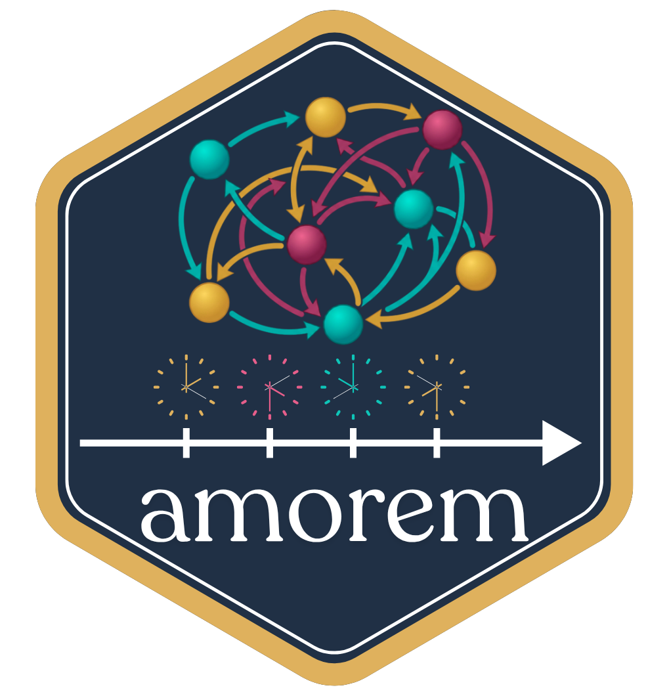

# amorem

<p align="center">
  
</p>
<p align="center">
  <a href="https://github.com/franciscorichter/amorem/actions/workflows/R-CMD-check.yaml"></a>
  <a href="https://franciscorichter.github.io/amorem/"></a>
  
</p>

**amorem** is an R package for
simulation and inference in relational event models (REMs) and relational
*hyper* event models (RHEMs) — dynamic network data in continuous time.

## 📖 Documentation

**Everything lives on the documentation site:**

### → [franciscorichter.github.io/amorem](https://franciscorichter.github.io/amorem/)

Installation, the quick-start tutorial, the full guide set (simulation,
endogenous catalogue, estimation, hyperedge models, datasets, real-data
analysis, validation experiments), and the complete function reference are
all there.

## What the package covers

- **Simulation** — `simulate_relational_events()` with an exact Gillespie
  kernel or an approximate tau-leap kernel; simulators for undirected and
  directed hyper-events.
- **Data intake** — `standardize_event_log()`, `sample_non_events()`
  (case-control sampling), `attach_static_covariates()`,
  `simulate_actor_covariates()`.
- **Statistics** — `endogenous_features()` (timing, closure and balance
  effects of Juozaitienė & Wit) and `hyperedge_features()`.
- **Estimation** — `rem()` with three backends: `clogit` (conditional-logistic
  partial likelihood), `gam` (one-control binomial form with smooth,
  time-varying and random effects: `tv()`, `nl()`, `tvnl()`, `re()`), and `nn`
  (neural or additive-spline scorer; `nn_uncertainty()` gives bootstrap bands,
  and `nn_control(engine = "torch")` is optional).
- **Model comparison and fit** — `compare_models()` and its `_global` /
  `_smooth` variants; martingale-residual goodness of fit (`gof_*()`,
  `martingale_residuals()`).
- **Data** — nine documented event logs (`data/`, sources in `data-raw/`).

## Development

```r
devtools::document()        # regenerate man/ and NAMESPACE
devtools::test()            # tests/testthat
devtools::check(cran = TRUE)
pkgdown::build_site()       # docs site; deployed to the gh-pages branch
```

CI runs `R CMD check` on GitHub Actions (`.github/workflows/R-CMD-check.yaml`).
Web-only guides live in `vignettes/articles/` and are excluded from the CRAN
build.

**Remotes.** `origin` is GitHub (public; CRAN `URL`, issues, the docs site).
`forge` is the private Forgejo working copy (`forge:pancho/amorem`).

## Status

- **CRAN:** 1.0.0, published 2026-06-29. Version 1.0.1 (the `compare_models()`
  stratification fix under **survival** < 3.7-3) is tagged `v1.0.1` and prepared in `DESCRIPTION`,
  `NEWS.md` and `cran-comments.md`, but CRAN still serves 1.0.0.
- **Planned for 1.1.0:** a hyper-event case-control sampler with history-aware
  masking, so that hyper-event data can be fitted with `rem()`; resolving the
  S3 class clash on `"rem"` with `relevent::rem()` and `redeem::rem()`.
- **Open checks:** the `coxme` path with two random-effect axes
  (`random_effects = c("sender", "receiver")`) may still be affected by the
  stratification bug; validation artefacts that call `compare_models()` with
  more than one control report shifted absolute log-likelihood and AIC
  (Δ columns are unaffected).
- **Companion paper:** the software paper describing version 1.0.0 is being
  revised outside this repository (host `air`,
  `~/System/Research/amorem-revision-20260812/`). The local `paper/` folder is
  gitignored.

## References

Methodological background for the models implemented in **amorem**:

- Bianchi, F., Filippi-Mazzola, E., Lomi, A., & Wit, E. C. (2024). Relational
  Event Modeling. *Annual Review of Statistics and Its Application*, 11,
  297–319. <https://doi.org/10.1146/annurev-statistics-040722-060248>
- Boschi, M., & Wit, E. C. (2026). Introduction to Relational Event Modelling.
  *arXiv:2604.07063*. <https://arxiv.org/abs/2604.07063>
- Juozaitienė, R., & Wit, E. C. (2024). Relational event modelling with
  timing, closure and actor-heterogeneity effects.
  *Journal of the Royal Statistical Society Series A*, 188(4).
  <https://doi.org/10.1093/jrsssa/qnae132>
- Boschi, M., Lerner, J., & Wit, E. C. (2025). Relational hyper event models
  with time-varying non-linear effects. *arXiv:2509.05289*.
  <https://arxiv.org/abs/2509.05289>

## License

MIT, see `LICENSE`.
