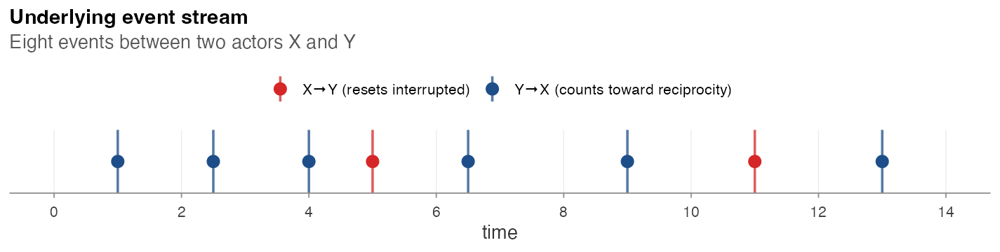
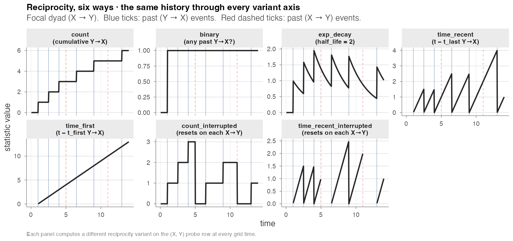

# Endogenous catalogue

## Endogenous catalogue

`amorem` exposes 74 numeric endogenous statistics — 66 with a compiled
C++ fast path, 8 in pure R — plus the `sender_receivers_set`
list-column, organised into six families × seven variant axes. The same
history can be summarised many ways; the variant axis decides which way.
The simulator and the post-hoc
[`endogenous_features()`](https://franciscorichter.github.io/amorem/reference/endogenous_features.md)
engine cover the catalogue together, and every shared statistic is
parity-tested on common event logs.

------------------------------------------------------------------------

### The six variant axes, side by side

Eight events between two actors `X` and `Y` (blue ticks: `Y → X`, red
ticks: `X → Y`):

Event stream

For the focal dyad `X → Y`, every reciprocity variant computes a
different summary of this exact history:

Variant traces

| Variant | Reads as | What changes at each tick |
|----|----|----|
| `count` | cumulative count of past `Y → X` events | +1 at each blue tick |
| `binary` | “any past `Y → X`?” | jumps 0 → 1 at the first blue tick, then stays |
| `exp_decay` | weighted count with half-life `h` | adds 1 at each blue tick, decays in between |
| `time_recent` | `t − t_last (Y → X)` | resets to 0 at each blue tick, climbs linearly between |
| `time_first` | `t − t_first (Y → X)` | monotone linear ramp once the first blue tick fires |
| `count_interrupted` | count *since the most recent `X → Y` event* | resets to 0 at each red tick |
| `time_recent_interrupted` | `time_recent` reset at each red tick |  |

The `*_interrupted` family is the central methodological distinction of
Juozaitienė & Wit (2024): a closure event “resets” the relevant counter,
so the statistic measures only the most recent unclosed cycle. On
Manufacturing it carries information distinct from `*_time_recent`
([Real-data
analysis](https://franciscorichter.github.io/amorem/articles/real-data-analysis.md)).

Driver script: `paper/wiki/experiments/variant_traces.R`.

------------------------------------------------------------------------

### The six families

| Family | Captures | Closure pattern |
|----|----|----|
| Per-actor | sender outdegree, receiver indegree, last-event recency | (no closure — per-actor totals) |
| Reciprocity | has the receiver previously fired toward the sender? | $`s \to r`$ cycles $`r \to s`$ |
| Transitivity | closure of two-paths | $`s \to k`$, $`k \to r`$ ⇒ $`s \to r`$ |
| Cyclic | closure of three-cycles | $`r \to k`$, $`k \to s`$ ⇒ $`s \to r`$ |
| Sending balance | joint sending behaviour vs alters | $`s \to k`$, $`r \to k`$ co-occur |
| Receiving balance | joint receiving behaviour vs alters | $`k \to s`$, $`k \to r`$ co-occur |

For every closure family, all six variant axes are available; some
families additionally expose an `ordered` axis (constrained direction of
two-path traversal). The full set is:

| Family | Statistic names |
|----|----|
| Per-actor | `sender_outdegree`, `receiver_indegree`, `recency` |
| Reciprocity | `reciprocity_binary`, `reciprocity_count`, `reciprocity_exp_decay`, `reciprocity_time_recent`, `reciprocity_time_first`, `reciprocity_binary_interrupted`, `reciprocity_count_interrupted`, `reciprocity_exp_decay_interrupted`, `reciprocity_time_recent_interrupted`, `reciprocity_time_first_interrupted` |
| Transitivity | `transitivity_binary`, `transitivity_count`, `transitivity_binary_ordered`, `transitivity_count_ordered`, `transitivity_exp_decay`, `transitivity_exp_decay_ordered`, `transitivity_time_recent`, `transitivity_time_first`, `transitivity_time_recent_ordered`, `transitivity_time_first_ordered`, `transitivity_time_recent_interrupted`, `transitivity_time_first_interrupted`, `transitivity_count_interrupted`†, `transitivity_binary_interrupted`†, `transitivity_exp_decay_interrupted`† |
| Cyclic | `cyclic_binary`, `cyclic_count`, `cyclic_binary_ordered`, `cyclic_count_ordered`, `cyclic_exp_decay`, `cyclic_exp_decay_ordered`, `cyclic_time_recent`, `cyclic_time_first`, `cyclic_time_recent_ordered`, `cyclic_time_first_ordered`, `cyclic_time_recent_interrupted`, `cyclic_time_first_interrupted`, `cyclic_count_interrupted`†, `cyclic_binary_interrupted`†, `cyclic_exp_decay_interrupted`† |
| Sending balance | `sending_balance_binary`, `sending_balance_count`, `sending_balance_binary_ordered`, `sending_balance_count_ordered`, `sending_balance_exp_decay`, `sending_balance_exp_decay_ordered`, `sending_balance_time_recent`, `sending_balance_time_first`, `sending_balance_time_recent_ordered`, `sending_balance_time_first_ordered`, `sending_balance_time_recent_interrupted`, `sending_balance_time_first_interrupted`, `sending_balance_count_interrupted`†, `sending_balance_binary_interrupted`†, `sending_balance_exp_decay_interrupted`† |
| Receiving balance | `receiving_balance_binary`, `receiving_balance_count`, `receiving_balance_binary_ordered`, `receiving_balance_count_ordered`, `receiving_balance_exp_decay`, `receiving_balance_exp_decay_ordered`, `receiving_balance_time_recent`, `receiving_balance_time_first`, `receiving_balance_time_recent_ordered`, `receiving_balance_time_first_ordered`, `receiving_balance_time_recent_interrupted`, `receiving_balance_time_first_interrupted`, `receiving_balance_count_interrupted`†, `receiving_balance_binary_interrupted`†, `receiving_balance_exp_decay_interrupted`† |

† Post-hoc only at the moment; the simulator’s inner loop does not yet
generate from these variants.

------------------------------------------------------------------------

### Bipartite support

The simulator’s closure-family state matrices are sized `|U| × |U|` over
the unified actor universe;
[`endogenous_features()`](https://franciscorichter.github.io/amorem/reference/endogenous_features.md)
is universe-agnostic via its string-keyed history. Both paths handle
bipartite and arbitrarily overlapping sender / receiver sets for every
closure-family statistic, and are cross-validated on bipartite seeds by
the parity test suite.

------------------------------------------------------------------------

### Parity status

The same closure-family statistics produced by the simulator “on the
fly” and re-computed post-hoc agree row-for-row on timing variants
(`*_time_recent`, `*_time_first`, `*_time_*_interrupted`), but the
**count** and **exp_decay** families currently show an O(events)-scale
gap that needs investigation — see [Validation experiments /
E4](https://franciscorichter.github.io/amorem/articles/validation-experiments.md).
Until that gap closes, treat the post-hoc engine as authoritative for
count statistics in downstream model fitting.
