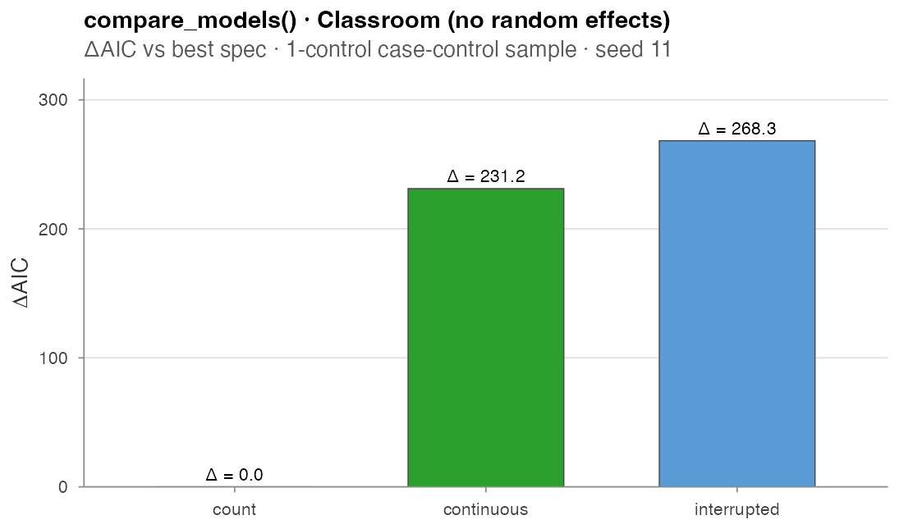
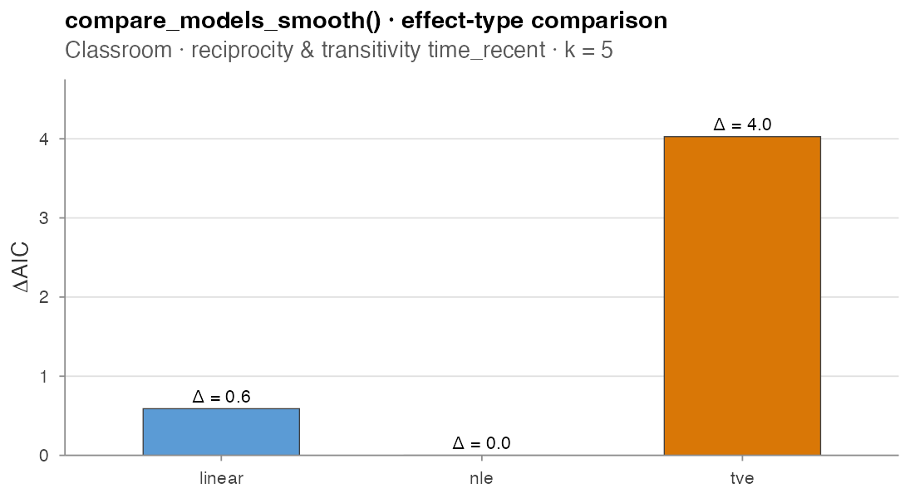
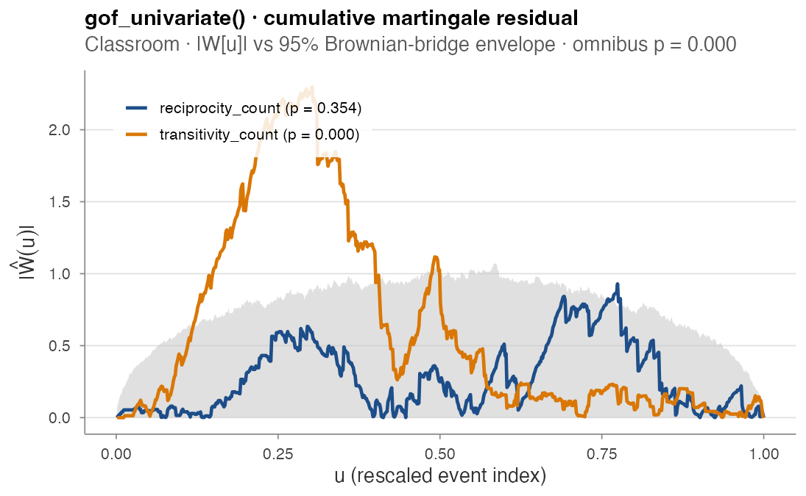
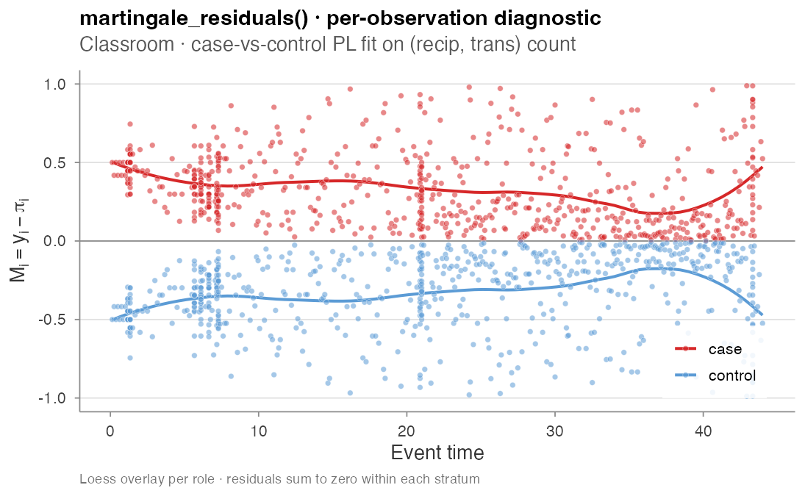

# Estimation

## Estimation

`amore`’s estimation surface has these layers:

1.  **Case-control sampling** turns a raw event log into a stratified
    table that survival / GLM tools can fit directly
    ([`sample_non_events()`](https://franciscorichter.github.io/amore/reference/sample_non_events.md);
    [`widen_case_control()`](https://franciscorichter.github.io/amore/reference/widen_case_control.md)
    reshapes it to the wide case-1-control form).
2.  **[`rem()`](https://franciscorichter.github.io/amore/reference/rem.md)**
    — the unified fitter for (already preprocessed) case-control data: a
    conditional-logit backend for case-k-control designs and a `gam`
    backend for case-1-control, with linear / TV / NL / TVNL effects and
    [`summary()`](https://rdrr.io/r/base/summary.html) /
    [`coef()`](https://rdrr.io/r/stats/coef.html) /
    [`plot()`](https://rdrr.io/r/graphics/plot.default.html) methods.
3.  **`compare_models*` helpers** evaluate a list of candidate
    specifications on a single sample and return a tidy AIC table
    (superseded by
    [`rem()`](https://franciscorichter.github.io/amore/reference/rem.md),
    still supported).
4.  **Goodness-of-fit tests** check whether the selected fit is actually
    adequate.

Every numerical output below is produced by
`paper/wiki/experiments/est_demo.R`, which is re-run on every release of
the wiki.

------------------------------------------------------------------------

### Case-control sampling

The partial likelihood for a relational event model factors over events,
with each factor a ratio between the firing dyad’s rate and the sum of
rates over the risk set at that moment. The *case-control* approximation
replaces the full risk set sum with an unbiased Horvitz-Thompson
estimate that uses `n_controls` sampled non-firing dyads per case.

Throughout this page we use the bundled `classroom_events` log — any
event log with `time`, `sender`, `receiver` columns will do.

``` r

library(amore)
data(classroom_events)

cc <- sample_non_events(classroom_events,
                        n_controls = 1,
                        scope      = "all",
                        mode       = "one")
```

`scope` selects which non-firing dyads form the candidate pool (`"all"`,
`"appearance"`, or `"citation"`); `mode` selects the sampling design
(`"one"` matched-set or `"two"` permuted).

**Risk-set exclusions.** Two further controls keep ineligible dyads out
of the candidate pool. `exclude_pairs` is a two-column
`(sender, receiver)` table of dyads that are *structurally* ineligible —
e.g. an alien species’ native range, forbidden transitions,
same-department pairs — and are never sampled as controls. And under
`risk = "remove"`, a dyad firing at the focal event’s own timestamp is
now treated as a concurrent event (not a valid non-event at that
instant) and excluded from its control pool:

``` r

cc <- sample_non_events(event_log,
                        scope         = "all",
                        mode          = "two",
                        risk          = "remove",          # drops past + concurrent
                        exclude_pairs = native[, c("species", "region")])
```

For `n_controls = 1` the estimator is a no-intercept binomial GLM on
case-minus-control differences (asymptotically equivalent to the
case-control partial likelihood for 1:1 matched designs). For
`n_controls > 1` it is a stratified Cox model via
[`survival::coxph`](https://rdrr.io/pkg/survival/man/coxph.html) (the
same machinery
[`survival::clogit`](https://rdrr.io/pkg/survival/man/clogit.html) calls
internally). AIC values are comparable across specifications that share
a case-control draw.

To compute endogenous covariates for the sampled non-events *without*
letting them enter the event history, pass the true event log as
`history_log` to
[`compute_endogenous_features()`](https://franciscorichter.github.io/amore/reference/compute_endogenous_features.md)
— only rows present in `history_log` update the running network state.

For set-valued covariates, the `"sender_receivers_set"` statistic
returns a **list-column**: for each row, the set of receivers the row’s
sender has reached before it (e.g. the regions a species has already
invaded). It honours `history_log` too, so it is correct for non-events.
Downstream, you join it to an external lookup to build the actual
covariate:

``` r

feats <- compute_endogenous_features(cc, stats = "sender_receivers_set",
                                     history_log = event_log)
feats$invaded <- Map(setdiff, feats$sender_receivers_set, native_range(feats$sender))
feats$dt      <- mapply(min_climatic_diff, feats$invaded, feats$receiver, feats$time)
```

------------------------------------------------------------------------

### `rem()` · unified fitter for preprocessed data

When the covariates have already been computed — e.g. by
[`eventnet`](https://github.com/juergenlerner/eventnet) or by
[`compute_endogenous_features()`](https://franciscorichter.github.io/amore/reference/compute_endogenous_features.md)
— [`rem()`](https://franciscorichter.github.io/amore/reference/rem.md)
fits the model directly from the case-control table, decoupling fitting
from feature computation. It has three backends:

- **`method = "clogit"`** — conditional logistic regression on a
  **case-k-control** design
  ([`survival::clogit`](https://rdrr.io/pkg/survival/man/clogit.html)).
  Strata come from `stratum`, or are derived as `cumsum(case == 1)` for
  the eventnet blocked layout. Linear terms only.
- **`method = "nn"`** — a neural conditional-logistic model on the same
  case-k-control design as `clogit`: a multilayer perceptron scores
  every candidate and the loss is the softmax over each risk set,
  i.e. exactly the conditional partial likelihood with a *learned*
  nonlinear intensity in place of the linear predictor.
  Prediction-oriented — no coefficient table; it earns its keep when
  effects interact or bend in ways an additive model cannot capture.
  Pure R, no extra dependencies.
- **`method = "gam"`** — degenerate logistic regression on a
  **case-1-control** design
  ([`mgcv::gam`](https://rdrr.io/pkg/mgcv/man/gam.html)), supporting
  smooth effects. In the formula a bare name is a linear effect; wrap it
  as `tv(x)`, `nl(x)` or `tvnl(x)` for a time-varying, non-linear, or
  time-varying-non-linear smooth, or `re(x)` for an actor (or other
  grouping) random effect —
  `s(cbind(x_ev, x_nv), by = c(1, -1), bs = "re")`, the matched
  event/control random effect (identified when the event and control
  differ on `x`).

``` r

# case-20-control conditional logit (e.g. an eventnet-preprocessed log)
fit20 <- rem(IS_OBSERVED ~ individual.activity + dyadic.activity,
             data = lesmis, method = "clogit", stratum = "EVENT_INTERVAL")
coef(fit20); summary(fit20)

# case-1-control degenerate logistic with a non-linear effect
w    <- widen_case_control(lesmis, stratum = "EVENT_INTERVAL")
fit1 <- rem(~ nl(dyadic.activity), data = w, method = "gam")
plot(fit1)            # the fitted smooth panel

# neural conditional logit on the same long case-control log
fitnn <- rem(IS_OBSERVED ~ individual.activity + dyadic.activity,
             data = lesmis, method = "nn", stratum = "EVENT_INTERVAL",
             nn = nn_control(hidden = c(16, 8), epochs = 300, seed = 1))
summary(fitnn)               # architecture, held-out concordance
plot(fitnn$fit, type = "pdp")  # learned per-feature effect curves
```

The `nn` backend is trained full-batch with Adam, early-stops on a
held-out fraction of strata (`nn_control(validation = , patience = )`),
and standardizes features internally.
[`logLik()`](https://rdrr.io/r/stats/logLik.html) returns the partial
likelihood at the trained network, so
[`AIC()`](https://rdrr.io/r/stats/AIC.html)-style comparisons against
`clogit` fits are possible (with the usual caveats about effective
degrees of freedom for neural networks). Because it shares the
case-control machinery, everything upstream —
[`sample_non_events()`](https://franciscorichter.github.io/amore/reference/sample_non_events.md),
feature engineering, stratum handling — is identical to the other
backends.

[`widen_case_control()`](https://franciscorichter.github.io/amore/reference/widen_case_control.md)
reshapes a long case-(k-)control log into the wide `<cov>_ev` /
`<cov>_nv` / `d_<cov>` form the `gam` backend expects (one row per
case). Undirected logs (set-valued senders, no receiver column) are
supported throughout. Column resolution follows the eventnet conventions
(`x`, `d_x`, `x_ev`/`x_nv`, `transform_x_*`, `transformed_time`).

[`rem()`](https://franciscorichter.github.io/amore/reference/rem.md)
supersedes
[`compare_models()`](https://franciscorichter.github.io/amore/reference/compare_models.md)
/
[`compare_models_smooth()`](https://franciscorichter.github.io/amore/reference/compare_models_smooth.md)
/
[`compare_models_global()`](https://franciscorichter.github.io/amore/reference/compare_models_global.md),
which remain available and are documented below.

------------------------------------------------------------------------

### `compare_models()` · linear AIC table

A single call evaluates a list of candidate specifications on a shared
case-control sample:

``` r

data(classroom_events)
compare_models(
  classroom_events,
  models = list(
    count       = c("reciprocity_count", "transitivity_count"),
    continuous  = c("reciprocity_time_recent",
                    "transitivity_time_recent"),
    interrupted = c("reciprocity_time_recent_interrupted",
                    "transitivity_time_recent_interrupted")),
  n_controls = 1, seed = 11)
#>         model n_terms n_obs   log_lik      AIC delta_AIC
#> 1       count       2   691 -305.5233 615.0466     0.000
#> 2  continuous       2   691 -421.1231 846.2462   231.200
#> 3 interrupted       2   691 -439.6904 883.3809   268.334
```

Runtime: **0.3 s**.



compare_models AIC

**Read this with caution.** Without an actor-heterogeneity correction,
`*_count` statistics absorb sender / receiver activity differences
directly, so a spec that should encode *“how recently did this dyad
fire?”* reduces to *“how active is this sender?”*. The naive count win
is a well-known artefact. Adding a sender frailty term flips the ranking
to **continuous** by ΔAIC ≈ 6, recovering Table 3 of Juozaitienė & Wit
(2024) — see [Real-data
analysis](https://franciscorichter.github.io/amore/articles/real-data-analysis.md)
for the corrected fit.

| Argument | Meaning |
|----|----|
| `event_log` | data frame with `sender`, `receiver`, `time` |
| `models` | named list of character vectors of stat names |
| `n_controls` | controls per case (`1`: GLM; `> 1`: stratified Cox) |
| `scope`, `mode` | passed to [`sample_non_events()`](https://franciscorichter.github.io/amore/reference/sample_non_events.md) |
| `random_effects` | `"sender"` or `"receiver"` — see below |
| `half_life` | required when any spec uses an exp-decay stat |
| `seed` | for the shared case-control draw |
| `keep_fits` | if `TRUE`, attach the fitted models as `attr(result, "fits")` |

All three `compare_models*()` helpers accept `keep_fits = TRUE`, which
attaches the fitted model objects — one per spec, named by model — as
`attr(result, "fits")`, so an individual fit can be pulled out for
plotting its estimated effects:

``` r

res <- compare_models_smooth(event_log, models, keep_fits = TRUE)
plot(attr(res, "fits")[["nl"]])     # the chosen spec's smooth panel
```

#### Actor random effects

[`compare_models()`](https://franciscorichter.github.io/amore/reference/compare_models.md)
accepts `random_effects = "sender"` or `"receiver"` (requires
`n_controls > 1`). Internally this injects a Gamma
[`survival::frailty()`](https://rdrr.io/pkg/survival/man/frailty.html)
term on the requested actor axis into the stratified Cox fit, matching
the convention in Juozaitienė & Wit (2024).

Two-axis frailty (`random_effects = c("sender", "receiver")`) is
supported via [`coxme::coxme`](https://rdrr.io/pkg/coxme/man/coxme.html)
and is the right tool when both sender and receiver heterogeneity
matter; one `coxme` fit per spec typically runs in seconds to a minute
on Classroom-sized data. Requires the `coxme` package (Suggests).

------------------------------------------------------------------------

### `compare_models_smooth()` · TV / NL / TVNL effects

Where
[`compare_models()`](https://franciscorichter.github.io/amore/reference/compare_models.md)
fits a *single* coefficient per statistic,
[`compare_models_smooth()`](https://franciscorichter.github.io/amore/reference/compare_models_smooth.md)
lets each statistic take one of four effect types: `linear`, `tv`
(time-varying), `nl` (non-linear in the covariate), or `tvnl` (jointly
time-varying non-linear via a tensor product smooth). Implementation
follows [Boschi, Lerner & Wit (2025)](https://arxiv.org/abs/2509.05289)
Section 3.3:

``` r

compare_models_smooth(
  classroom_events,
  models = list(
    linear = c(reciprocity_time_recent  = "linear",
               transitivity_time_recent = "linear"),
    nl    = c(reciprocity_time_recent  = "nl",
               transitivity_time_recent = "nl"),
    tv    = c(reciprocity_time_recent  = "tv",
               transitivity_time_recent = "tv")),
  seed = 11, k = 5)
#>    model n_terms n_obs   log_lik      AIC delta_AIC
#> 1    nl       2   691 -418.3044 845.6569     0.000
#> 2 linear       2   691 -421.1231 846.2462     0.589
#> 3    tv       2   691 -420.7474 849.6835     4.027
```

Runtime: **1.9 s**.



compare_models_smooth AIC

The three specs are within 4 AIC points of each other on the
recency-time terms — there is no signal in this dataset that a
time-varying or non-linear effect adds value over the linear baseline.
The case-vs-control matrix design behind these fits is described in
detail at the bottom of this section.

| Effect | Smooth term |
|----|----|
| `linear` | single column `d_stat = case − control` |
| `tv` | `s(.time, by = d_stat)` |
| `nl` | `s(stat_mat, by = I_mat)` with `stat_mat = cbind(case, control)`, `I_mat = cbind(1, -1)` |
| `tvnl` | `te(time_mat, stat_mat, by = I_mat)` |

The model is fit by `mgcv::gam(method = "REML")` with the degenerate
logistic likelihood from Boschi et al. equation 8. AIC values are
directly comparable across specs because every fit shares the same
case-control sample.

------------------------------------------------------------------------

### `compare_models_global()` · global covariate effects

A *global* covariate varies in time but is constant across all
interacting pairs at any given instant — temperature, time-of-day, the
residual baseline hazard `g_0(t)`. Standard case-control partial
likelihood structurally cannot identify a global effect because it
cancels in the focal-vs-control rate ratio (both pairs are evaluated at
the same time). The fix of [Lembo, Juozaitienė, Vinciotti & Wit
(2025)](https://doi.org/10.1093/jrsssc/qlaf058) is a random per-dyad
time shift `H_sr ~ Exp(rate)`, so the focal event and the sampled
non-event are evaluated at *different* times. With one non-event per
event the partial likelihood collapses to a degenerate logistic GAM that
`mgcv` fits directly:

``` r

g <- data.frame(time        = seq(0, max(classroom_events$time), length = 50),
                temperature = sin(seq(0, 2 * pi, length = 50)))
compare_models_global(
  classroom_events,
  models = list(
    dyadic_only = c(reciprocity_count = "linear",
                    transitivity_count = "linear"),
    with_global = c(reciprocity_count = "linear",
                    temperature       = "global_smooth")),
  global_covariates = g, seed = 11, k = 5)
```

| Effect type     | Smooth                   | Use                         |
|-----------------|--------------------------|-----------------------------|
| `global_smooth` | `s(x_global)`            | generic global covariate    |
| `global_cyclic` | `s(x_global, bs = "cc")` | periodic axes (time-of-day) |
| `global_time`   | smooth on time itself    | recovers residual `g_0(t)`  |

`shift_scale` (default `1`) multiplies the mean inter-event time used to
set the exponential rate of `H_sr`. Larger values widen the shifts and
improve identifiability of slow global signals at the cost of bias under
fast-varying `g_0`. The `global_time` spec can produce a degenerate fit
on small / uninformative data — when this happens the result is `NA`
rather than a hard error.

#### Recency preprocessing

`transform_recency(delta, half_life = NULL, reference = NULL)` maps
non-negative inter-event time gaps to bounded weights via
`exp(-delta / (2 m))`, with `m` the median of the supplied (or
reference) gaps. Default median rule sends zero → 1 and the median gap →
`exp(-1/2) ≈ 0.607`. Useful as a preprocessing step for global /
exogenous covariates fed into
[`compare_models_global()`](https://franciscorichter.github.io/amore/reference/compare_models_global.md).

------------------------------------------------------------------------

### Goodness-of-fit · cumulative martingale residual tests

`amore` implements the four GOF tests of [Boschi & Wit
(2025)](https://doi.org/10.1007/s11222-025-10751-2) on the cumulative
martingale residual process `G[γ̂, u]`. After normalisation,
`Ŵ[γ̂, u] = Ĵ^{-1/2} · n^{-1/2} · G[γ̂, u]` converges to a standard
(multivariate) Brownian bridge under correct specification.

``` r

m <- c(reciprocity_count  = "linear",
       transitivity_count = "linear")

gof_univariate(classroom_events, m, "reciprocity_count",  seed = 11)
#> $statistic        : 0.929
#> $p_value          : 0.354          # not rejected
gof_univariate(classroom_events, m, "transitivity_count", seed = 11)
#> $statistic        : 2.299
#> $p_value          : 0.000          # rejected -- transitivity is misspecified

gof_global(classroom_events, m, seed = 11)
#> $statistic : 3089.6
#> $p_value   : 0.000                 # overall model rejected
```



GOF cumulative process

`reciprocity_count`’s process (blue) stays inside the 95 %
Brownian-bridge envelope; `transitivity_count`’s process (orange) shoots
well above the envelope around `u ≈ 0.30`, where the running residual is
most informative. The omnibus Cauchy combination rejects the overall
model with `p < 10⁻³` — and the per-component test pinpoints
`transitivity_count` as the offender. The right next move is to enrich
the transitivity term (try `tv`, `nl`, or a finer variant from the
[Endogenous
catalogue](https://franciscorichter.github.io/amore/articles/endogenous-catalogue.md))
and re-test.

| Function | Statistic | p-value |
|----|----|----|
| `gof_univariate` | `T_x = sup_u |Ŵ[u]|` | exact KS series (eq. 15) |
| `gof_multivariate` | `T_ψ = sup_u ‖Ŵ[u]‖²` | `n_sim` simulated q-dim Brownian bridges |
| `gof_global` | `T_o = mean tan(π(½ − P_l))` | `½ − arctan(T_o)/π` (Liu & Xie 2020) |
| `gof_auxiliary` | `T_φ = sup_u |G[u]|/√n` | `n_sim` standard-normal multipliers |

These tests are complementary to the AIC-based selection performed by
`compare_models*()`: AIC ranks competing fits, GOF tests check that the
ranked-best fit is actually adequate.

------------------------------------------------------------------------

### Pointwise diagnostic · `martingale_residuals()`

For a more granular per-observation view,
[`martingale_residuals()`](https://franciscorichter.github.io/amore/reference/martingale_residuals.md)
returns one row per case-control observation with the residual
`M_i = y_i − π_i` where `π_i = exp(η_i) / (exp(η_case) + exp(η_ctrl))`
is the fitted probability that observation `i` is the case in its
two-element risk set:

``` r

res <- martingale_residuals(
  classroom_events,
  model = c(reciprocity_count  = "linear",
            transitivity_count = "linear"),
  seed = 7)
# Residuals sum to zero within each (case, control) stratum:
#> Min       1st Qu    Median    Mean    3rd Qu    Max
#> -1.7e-16 -5.6e-17   0.0e+00  -3.6e-18 4.1e-17   2.2e-16
```



Martingale residuals over time

The within-stratum zero-sum invariant holds to machine precision. The
loess overlays per role would land on zero under correct specification;
the visible separation here is consistent with the GOF rejection above.
Currently linear-effect specs only.

------------------------------------------------------------------------

### Coming next · DREAM (Filippi-Mazzola & Wit 2024)

`compare_models_smooth(... = "nl")` fits non-linear effects with
[`mgcv::gam`](https://rdrr.io/pkg/mgcv/man/gam.html) + a B-spline basis.
That works well at Classroom / Manufacturing scale, but the spline-basis
matrix becomes a memory bottleneck once both the actor universe and the
number of non-linear covariates grow.

[Filippi-Mazzola & Wit (2024, *Social Networks* 79,
25-33)](https://doi.org/10.1016/j.socnet.2024.05.004) propose **DREAM**
— Deep Relational Event Additive Model. Each effect $`f_k(x_{srk})`$ is
fit by an *independent* small feed-forward neural network (Neural
Additive Model architecture), trained with ADAM on the same NCC partial
likelihood `amore` already uses (eq. 3 of the paper = our
`n_controls = 1` binomial-GLM path). Uncertainty bands come from either
a non-parametric bootstrap or a post-hoc Gaussian Process regression
refit on a small bootstrap sample.

The empirical win:

| Scale | [`mgcv::gam`](https://rdrr.io/pkg/mgcv/man/gam.html) (NL) | DREAM |
|----|----|----|
| 100k events × 1k actors, 10 covariates | ~500 s | ~80 s |
| 500k events × 5k actors, 4 covariates | ~600 s | ~50 s |
| 500k events × 5k actors, ≥ 5 covariates | fails to converge | converges |
| 100 M citations × 8 M actors (US patents) | not feasible | feasible |

Planned `amore` integration:

``` r

compare_models_dream(
  event_log, models,
  hidden     = c(64, 64),    # ANN architecture per covariate
  activation = "gcu",         # Growing Cosine Unit (paper §A.1)
  dropout    = 0.1,
  epochs     = 200,
  uncertainty = "gpr",        # or "bootstrap"
  device     = c("cpu","mps","cuda"))
```

Backend: the `torch` R package (`mlverse`, no Python). Suggests-only —
users without `torch` keep the `mgcv` path. Output contract matches
[`compare_models_smooth()`](https://franciscorichter.github.io/amore/reference/compare_models_smooth.md)
so the `gof_*` battery plugs in unchanged.
