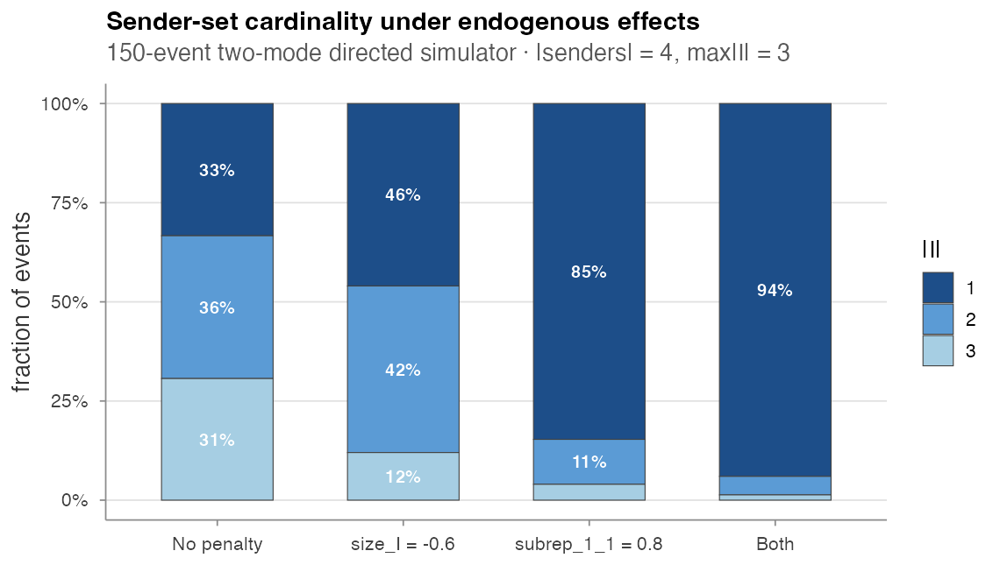
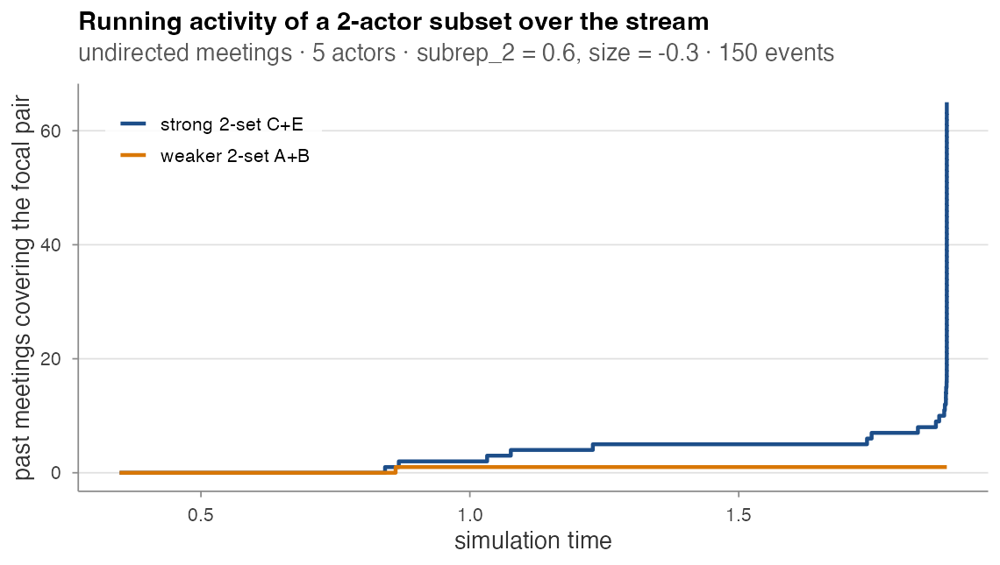

# Hyperedge models

## Hyperedge models

`amorem` supports **relational hyper event models** (RHEMs) — the
extension of REMs from dyadic `(sender, receiver, time)` events to
set-valued `(I, J, time)` hyperedges, where `I` is a set of senders and
`J` is a set of receivers. Following [Boschi, Lerner & Wit
(2025)](https://arxiv.org/abs/2509.05289), this lets a single event
involve multiple actors per axis — e.g. a paper authored by a co-author
set citing a set of references, or a multi-actor meeting (`J = ∅`).

Driver script for the experiments below:
`paper/wiki/experiments/hyper_demo.R`.

------------------------------------------------------------------------

### Data model

``` r

hl <- hyperedge_log(
  I    = list(c("alice", "bob"), c("alice", "carol"), c("bob", "carol")),
  J    = list(c("paperA"),        c("paperA", "paperB"), c("paperB")),
  time = c(1.0, 2.5, 4.0))

is_hyperedge_log(hl)         # TRUE
hyperedge_sizes(hl)
#>              I              J time size_I size_J
#> 1   alice, bob         paperA  1.0      2      1
#> 2 alice, carol paperA, paperB  2.5      2      2
#> 3   bob, carol         paperB  4.0      2      1
```

| Function | Purpose |
|----|----|
| `hyperedge_log(I, J, time)` | Validating constructor; sorts by time |
| `is_hyperedge_log(x)` | Structural predicate |
| `as_hyperedge_log(event_log)` | Promote a dyadic log (each row becomes a singleton on each axis) |
| `as_dyadic_log(h)` | Inverse — succeeds only when `|I| = |J| = 1` everywhere |
| `hyperedge_sizes(h)` | Adds `size_I` and `size_J` columns |

For **undirected hyperevents** (e.g. multi-actor meetings), pass
`J = list(character(0), ...)` and use the actor-only simulator below.

------------------------------------------------------------------------

### Subset repetition

The canonical hyperedge-native covariates from the paper (eq. 3-4):

``` r

hyperedge_activity(hl, I = c("alice", "bob"), J = "paperA", t = 5)
#> [1] 1                # one past event contains {alice, bob} and {paperA}

hyperedge_subrep(hl, I = c("alice", "bob", "carol"), J = "paperA",
                 t = 5, rho = 2, l = 1)
#> [1] 0.6666667        # 2 of the 3 size-2 subsets of I have co-fired with paperA
```

For dyadic events with `|I| = |J| = 1`,
`hyperedge_subrep(rho = 1, l = 1)` reduces to the standard dyad event
count.

#### Feature engine

[`compute_hyperedge_features()`](https://franciscorichter.github.io/amorem/reference/compute_hyperedge_features.md)
is the hyperedge analogue of
[`compute_endogenous_features()`](https://franciscorichter.github.io/amorem/reference/compute_endogenous_features.md):

``` r

feat <- compute_hyperedge_features(hl,
  stats = c("activity", "subrep_1_1", "subrep_2_1"))
```

| Stat name | Meaning |
|----|----|
| `"activity"` | `hyperedge_activity` on each row’s `(I, J)` |
| `"subrep_<rho>_<l>"` | directed subset repetition |
| `"subrep_<rho>"` | undirected subset repetition (`l = 0`) |
| any name in the 68-stat catalogue | delegated to [`compute_endogenous_features()`](https://franciscorichter.github.io/amorem/reference/compute_endogenous_features.md) after [`as_dyadic_log()`](https://franciscorichter.github.io/amorem/reference/hyperedge_log.md) — requires every row to be dyadic |

------------------------------------------------------------------------

### Two-mode directed simulator

For citation-style data (Boschi et al. 2025 Section 5):

``` r

hl <- simulate_directed_hyperedge_events(
  n_events  = 50,
  senders   = paste0("author", 1:5),
  receivers = paste0("paper",  1:5),
  max_size_I = 2, max_size_J = 2,
  baseline_rate = 0.3,
  endogenous_stats   = c("subrep_1_1", "size_I"),
  endogenous_effects = c(subrep_1_1 = 0.8, size_I = -0.4))
```

Supported endogenous stats: `"size_I"`, `"size_J"`, `"activity"`,
`"subrep_<rho>_<l>"`. Output is a
[`hyperedge_log()`](https://franciscorichter.github.io/amorem/reference/hyperedge_log.md)
with non-empty `I` and `J` on every row.

#### What the two endogenous effects do

A 150-event sweep on 4 senders × 4 receivers, varying the endogenous
terms one at a time:

| Specification      | mean `|I|` | mean `|J|` |
|--------------------|-----------:|-----------:|
| No penalty         |       1.97 |       1.60 |
| `size_I = -0.6`    |       1.66 |       1.59 |
| `subrep_1_1 = 0.8` |       1.19 |       1.05 |
| Both               |       1.07 |       1.14 |



Cardinality distributions

- **`size_I < 0`** broadens the size distribution toward smaller sender
  sets (`|I| = 1` jumps from 33 % to 46 %).
- **`subrep_1_1 > 0`** collapses the distribution onto pairs the log has
  already seen — and most repeating pairs are singletons, so `|I| = 1`
  dominates (85 % under the subrep-only spec).
- **Both** combine: 94 % singleton sender sets.

This is exactly the levers the Boschi et al. (2025) framework exposes
for shaping a citation-style stream.

Per-event cost is exponential in `|V^I|, |V^J|` because the simulator
enumerates every candidate `(I, J)` per event; practical for small
universes (≤ ~10 each side, `max_size ≤ 3`).

------------------------------------------------------------------------

### Undirected meeting simulator

For undirected multi-actor meetings (Section 4 of the paper):

``` r

hl <- simulate_hyperedge_events(
  n_events           = 150,
  actors             = LETTERS[1:5],
  max_size           = 3,
  baseline_rate      = 0.3,
  endogenous_stats   = c("subrep_2", "size"),
  endogenous_effects = c(subrep_2 = 0.6, size = -0.3))
```

The simulator enumerates every subset of `actors` of size
`min_size..max_size`, scores each via the rolling event history, draws
an event proportional to its exp-score, and waits an exponential time
with rate equal to the total score. Output: a
[`hyperedge_log()`](https://franciscorichter.github.io/amorem/reference/hyperedge_log.md)
with empty receiver sets.

#### Preferential attachment from `subrep`

When `subrep > 0`, a positive feedback loop locks in: a subset that
fires once becomes more likely to fire again. Tracking the running
`hyperedge_activity` of two focal pairs across a 150-event meeting
stream:



Running activity of a focal pair

One 2-actor pair (`{C, E}`) accumulates almost all the co-attendance
mass; the other (`{A, B}`) gets one event in the entire stream. Under
`subrep_2 = 0.6`, 146 of the 150 meetings contain the same pair. This is
the kind of dynamic the `subrep_<rho>` family is designed to detect and
the kind of runaway you should expect (or design against) when the
effect is strong.

------------------------------------------------------------------------

### Smooth effects on hyperedge data

Once features are computed, you can fit linear / TV / NL / TVNL
specifications via
[`compare_models_smooth()`](https://franciscorichter.github.io/amorem/reference/compare_models_smooth.md)
— see
[Estimation](https://franciscorichter.github.io/amorem/articles/estimation.md).
The case-control likelihood used by
[`compare_models_smooth()`](https://franciscorichter.github.io/amorem/reference/compare_models_smooth.md)
matches Boschi et al. (2025) equation 8.
