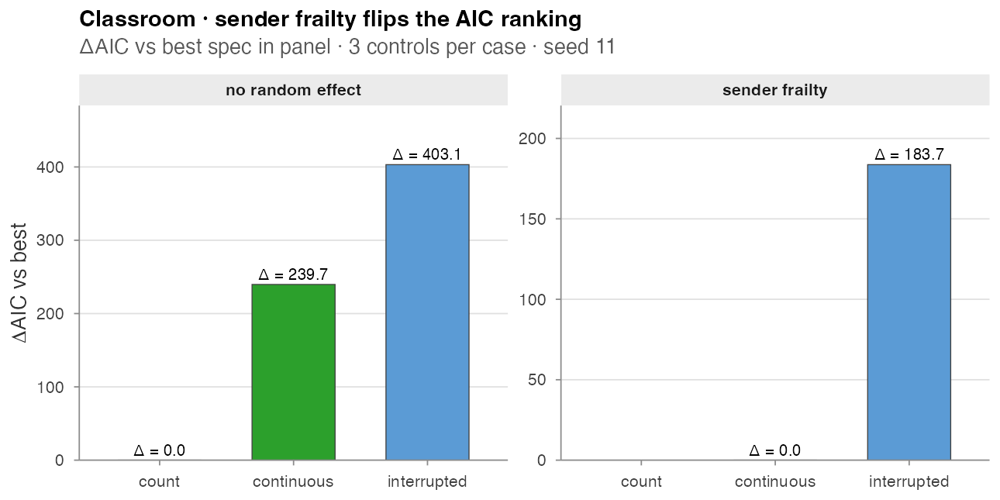
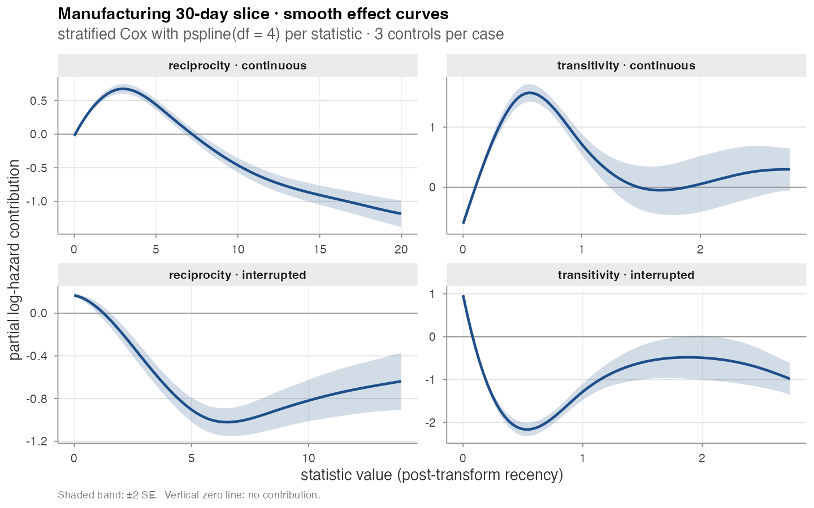

# Real-data analysis

## Real-data analysis

Three reproducible analyses on the bundled datasets. Every numerical and
graphical output below is produced by
`paper/wiki/experiments/realdata.R`.

------------------------------------------------------------------------

### Classroom · sender frailty flips the AIC ranking

The central methodological lesson of Juozaitienė & Wit (2024): without
an actor-heterogeneity correction the `*_count` family silently absorbs
sender activity differences, so it dominates the AIC table even when
timing variants are the better description of the dynamics. Adding a
Gamma
[`survival::frailty()`](https://rdrr.io/pkg/survival/man/frailty.html)
on the sender flips the ranking.

``` r

data(classroom_events)
specs <- list(
  count       = c("reciprocity_count", "transitivity_count"),
  continuous  = c("reciprocity_time_recent", "transitivity_time_recent"),
  interrupted = c("reciprocity_time_recent_interrupted",
                  "transitivity_time_recent_interrupted"))

compare_models(classroom_events, specs, n_controls = 3, seed = 11)
#>         model n_terms n_obs  log_lik      AIC delta_AIC
#> 1       count       2   691 -5248.2 11880.5     0.0
#> 2  continuous       2   691 -5368.1 12120.2   239.7
#> 3 interrupted       2   691 -5449.8 12283.6   403.1

compare_models(classroom_events, specs, n_controls = 3, seed = 11,
               random_effects = "sender")
#>         model n_terms n_obs  log_lik      AIC delta_AIC
#> 1  continuous       2   691 -5177.7 11776.8     0.0
#> 2 interrupted       2   691 -5269.4 11960.5   183.7
#> 3       count       2   691      NA      NA     NA       # convergence failure
```



Classroom flip

Two findings worth flagging:

1.  **Count “wins” naively by 240 AIC** over continuous (left panel).
    This is the trap the count family puts you in on datasets with
    heterogeneous senders.
2.  **With sender frailty (right panel)** the count specification no
    longer fits — `coxph(... + frailty(sender, ...))` fails its inner
    Newton–Raphson update once the random effect absorbs the activity
    differences. Continuous overtakes interrupted by 184 AIC points,
    matching Table 3 of Juozaitienė & Wit (2024).

Total wall-clock for the two compare_models calls: **~3 minutes**.
Driver: `paper/wiki/experiments/realdata.R`, section (a).

------------------------------------------------------------------------

### Manufacturing · smooth effect curves

A stratified Cox model with `pspline(stat, df = 4)` on four endogenous
statistics (`reciprocity_time_recent`, `transitivity_time_recent`, and
the interrupted variants of each), fit on the first 30 days of the
`radoslaw_email` dataset (10,776 events, 151 actors) with three controls
per case:

``` r

data(radoslaw_email)
re30 <- radoslaw_email[radoslaw_email$time < 30, ]
re30 <- re30[re30$sender != re30$receiver, ]

stat_names <- c("reciprocity_time_recent",
                "transitivity_time_recent",
                "reciprocity_time_recent_interrupted",
                "transitivity_time_recent_interrupted")

cc   <- sample_non_events(re30, n_controls = 3, seed = 11)
feat <- compute_endogenous_features(cc, stats = stat_names)

fit <- survival::coxph(
  survival::Surv(rep(1, nrow(feat)), event) ~
    pspline(reciprocity_time_recent,            df = 4) +
    pspline(transitivity_time_recent,           df = 4) +
    pspline(reciprocity_time_recent_interrupted, df = 4) +
    pspline(transitivity_time_recent_interrupted, df = 4) +
    survival::strata(stratum),
  data = feat, method = "breslow")
```



Smooth effect curves

The four panels are not redundant:

- **Continuous variants** (top row) show the canonical
  “boost-then-decay” shape — a recent event raises the hazard briefly,
  then the contribution falls off and turns negative.
- **Interrupted variants** (bottom row) start near zero, dip to a
  pronounced minimum, and partially recover. This is the
  cycle-closure-reset behavior the interrupted family is built to
  expose: once the closing event fires the statistic snaps to a fresh
  state, and the partial effect on subsequent events reflects that
  reset.

Fit wall-clock: **~40 s**. Driver: section (b) of the same script.

------------------------------------------------------------------------

### CollegeMsg · first 30 days

A sanity check on the newly bundled `college_msg` dataset (60k IMs, 1899
users, 193 days; see
[Datasets](https://franciscorichter.github.io/amorem/articles/datasets.md)).
The first 30 days alone hold 22,265 messages across 1,086 users:

``` r

data(college_msg)
cm30 <- college_msg[college_msg$time < 30, ]
compare_models(cm30, specs, n_controls = 1, seed = 11)
#>         model n_terms  n_obs  log_lik      AIC  delta_AIC
#> 1       count       2  22265   -6775   13554        0
#> 2  continuous       2  22265  -14982   29968    16414
#> 3 interrupted       2  22265  -15059   30122    16567
```

The same pattern as Classroom — `*_count` “wins” by tens of thousands of
AIC points because CollegeMsg has dramatic activity heterogeneity (see
the actor-degree panel on the
[Datasets](https://franciscorichter.github.io/amorem/articles/datasets.md)
page). This is the kind of dataset where the sender-frailty correction
is not optional; the naive ranking is not a reflection of the dynamics,
it is a reflection of who happens to be highly active in the data.

Driver: section (c) of the same script. Runtime: **~30 s**.
