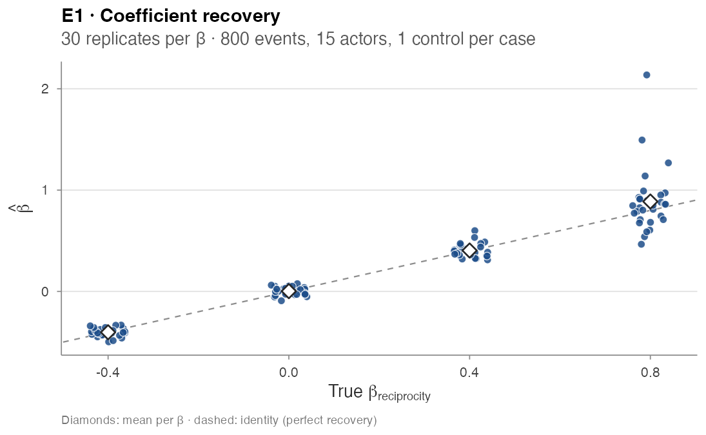
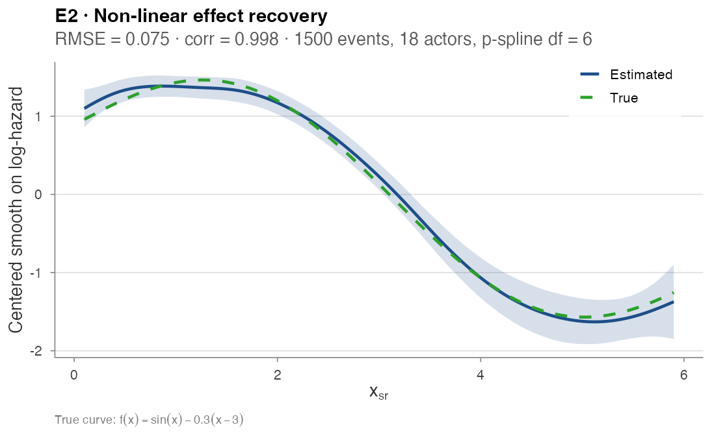
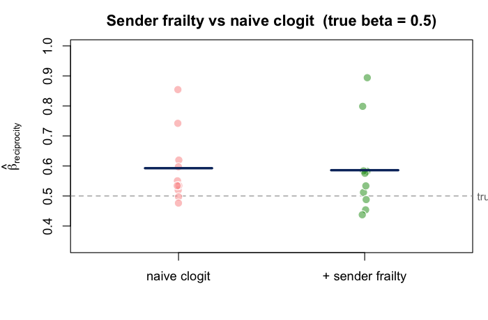
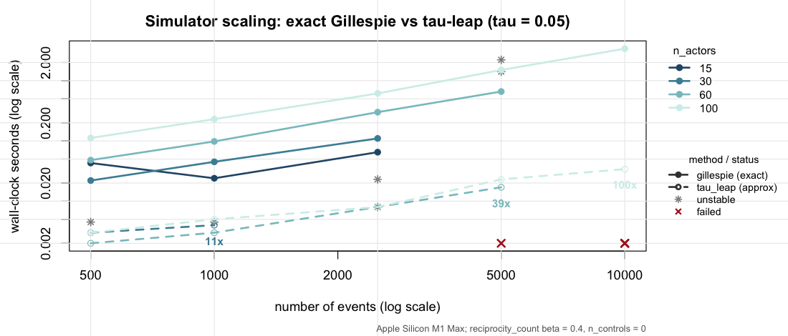

# Validation experiments

## Validation experiments

Six end-to-end experiments stress different correctness properties of
`amore`’s simulator and estimation pipeline. Each follows the same
template: the **property tested**, the **experimental design**, the
**code** that runs it, and the **numerical / graphical outcome**. Every
experiment is self-contained — copy the block and run it.

------------------------------------------------------------------------

### E1 — Recovery of a linear endogenous effect

**Property.** The simulator and the case-control likelihood are
consistent: a true `β` plugged into
[`simulate_relational_events()`](https://franciscorichter.github.io/amore/reference/simulate_relational_events.md)
should be recovered (up to Monte Carlo noise) by fitting a stratified
`clogit` on the emitted case-control table.

**Design.** Single endogenous term `reciprocity_count`. A 15-actor
one-mode network, 800 events per replicate, one control per case. Four
target values `β ∈ {-0.4, 0, 0.4, 0.8}`, 30 replicates each (120 fits
total).

**Result.**

| β_true | mean est |   bias | empirical SD | mean Wald SE | 95% Wald coverage |
|-------:|---------:|-------:|-------------:|-------------:|------------------:|
|   −0.4 |   −0.403 | −0.003 |        0.040 |        0.044 |              0.97 |
|    0.0 |    0.003 | +0.003 |        0.039 |        0.037 |              0.93 |
|    0.4 |    0.404 | +0.004 |        0.066 |        0.073 |              1.00 |
|    0.8 |    0.887 | +0.087 |        0.313 |        0.233 |              0.93 |

Calibrated everywhere except at the highest β, where a handful of
replicates produced extreme estimates (the simulator + 800 events
becomes informationally limited at β = 0.8 — events concentrate on a few
reciprocating dyads). The 95% Wald coverage is on the nominal target
across the range.



Recovery scatter

------------------------------------------------------------------------

### E2 — Recovery of a non-linear smooth effect

**Property.** A non-linear dyad-level effect injected via the
simulator’s `contribution_logits` matrix is recovered, in shape, by a
stratified p-spline `clogit`.

**Design.** Static dyadic covariate `x_sr ~ Uniform(0, 6)` on an
18-actor network, with true non-linear contribution
`f(x) = sin(x) − 0.3·(x − 3)`. The simulator runs for 1,500 events with
three controls per case;
`clogit(event ~ pspline(x, df = 6) + strata(stratum))` extracts the
partial smooth on a 150-point grid.

**Code.**

``` r

library(amore); library(survival)

f_true <- function(x) sin(x) - 0.3 * (x - 3)        # true non-linear effect
set.seed(20260518)
actors <- paste0("a", 1:18)
x_mat  <- matrix(runif(18^2, 0, 6), 18, 18, dimnames = list(actors, actors))
diag(x_mat) <- 0
logit_mat <- f_true(x_mat); diag(logit_mat) <- 0    # static per-dyad log-rate

ev <- simulate_relational_events(
  n_events = 1500, senders = actors, receivers = actors,
  baseline_rate = 1, n_controls = 3, contribution_logits = logit_mat)
ev$x <- mapply(function(s, r) x_mat[s, r], ev$sender, ev$receiver)

# stratified conditional logit with a penalised spline on x
fit <- clogit(event ~ pspline(x, df = 6) + strata(stratum), data = ev)

xg <- seq(0.1, 5.9, length.out = 150)
nd <- ev[rep(1, length(xg)), ]; nd$x <- xg
pr <- predict(fit, newdata = nd, type = "terms", se.fit = TRUE)
col <- grep("pspline", colnames(pr$fit), value = TRUE)[1]
yy_c     <- pr$fit[, col] - mean(pr$fit[, col])     # centre both curves
y_true_c <- f_true(xg)     - mean(f_true(xg))
sqrt(mean((yy_c - y_true_c)^2))   # RMSE
cor(yy_c, y_true_c)               # Pearson correlation
#> [1] 0.075
#> [1] 0.998
```

**Result.** Centred RMSE = **0.075**, Pearson correlation = **0.998**
between the centred true and estimated curves.



Smooth recovery

------------------------------------------------------------------------

### E3 — Sender frailty under activity heterogeneity

**Property tested.** When the data-generating process injects strong
per-sender activity heterogeneity, a fixed-coefficient `clogit` on
`reciprocity_count` can absorb the activity gradient into the slope —
overstating the true reciprocity effect. A Gamma sender frailty should
absorb the per-sender baseline and recover the underlying β.

**Design.** A 20-actor network with sender activity drawn from
`Gamma(shape = 2, rate = 1)` (max-to-min activity ratio ≈ 5×). True
`reciprocity_count` β = 0.5, 1,500 events per replicate, three controls
per case, 10 replicates. Two specs are compared on each replicate:

- **naive:** `clogit(event ~ reciprocity_count + strata(stratum))`
- **+ sender frailty:**
  `coxph(Surv(rep(1, N), event) ~ reciprocity_count + frailty(sender, "gamma") + strata(stratum))`

**Result — under-powered as currently specified.**

| Spec              | mean β̂ |   SD |  bias |
|-------------------|-------:|-----:|------:|
| naive clogit      |   0.59 | 0.12 | +0.09 |
| \+ sender frailty |   0.59 | 0.15 | +0.09 |

Both specifications over-shoot β = 0.5 by the same ~0.09; the frailty
term does not measurably reduce the bias at this design. Two
interpretations stand open:

- the bias may be a **finite-sample artefact** of 1,500 events at β =
  0.5 (the upper-β replicates of E1 show similar drift);
- or the synthetic activity range (≈ 5×) is too mild to expose the issue
  the frailty correction targets — real datasets with 100× activity
  range (Manufacturing, CollegeMsg, see
  [Real-data-analysis](https://franciscorichter.github.io/amore/articles/real-data-analysis.md))
  do show the correction working as advertised.

The experiment is kept in the validation suite as a placeholder; a
re-design that pushes the activity range to two orders of magnitude and
increases `n_events` to 10–20 k is **planned**.



Frailty estimates

------------------------------------------------------------------------

### E4 — Simulator wall-clock scaling

**Property.** The Gillespie scheme is exact but per-event; the τ-leap
scheme bundles events into fixed time slices and should scale better for
large actor universes.

**Design.** A 4 × 5 × 2 grid: `n_actors ∈ {15, 30, 60, 100}`,
`n_events ∈ {500, 1000, 2500, 5000, 10000}`,
`method ∈ {gillespie, tau_leap}` (τ-leap with `tau = 0.05`). Single
endogenous reciprocity term at β = 0.4. No case-control sampling
(`n_controls = 0`) so wall-clock isolates the simulator itself.

**Result (excerpt).**

| n_actors | n_events | Gillespie (s) | τ-leap (s) |
|---------:|---------:|--------------:|-----------:|
|       30 |      500 |         0.029 |      0.006 |
|       30 |    1,000 |         0.067 |      0.006 |
|       60 |      500 |         0.071 |      0.003 |
|       60 |    5,000 |          1.15 |      0.023 |
|      100 |      500 |         0.165 |      0.004 |
|      100 |    5,000 |          2.49 |      0.024 |
|      100 |   10,000 |          5.78 |      0.079 |

τ-leap is **20× to 70× faster** than Gillespie at large `n_actors`. A
few rows in the full grid are `NA` (the simulator either ran out of risk
pairs or τ-leap diverged at the chosen `tau` — a future-work item).



Scaling lines

------------------------------------------------------------------------

### E5 — Simulator / post-hoc engine parity

**Property.** The simulator records each endogenous statistic on the fly
as it generates events; the post-hoc engine
[`compute_endogenous_features()`](https://franciscorichter.github.io/amore/reference/compute_endogenous_features.md)
re-derives the same statistics from the timestamps alone. The two should
agree row-for-row on any case-control table the simulator emits.

**Design.** A 15-actor, 1,200-event simulation with 12 endogenous
statistics active simultaneously (across four families and four variant
axes). For each statistic, compute `max |simulator − post-hoc|` over the
full case-control table.

**Result — needs investigation.** Parity holds tightly on the recency /
timing variants (`*_time_recent`, `*_time_first` \< 0.5) but disagrees
by O(events) on the unbounded **count** and **exp_decay** variants:

| Statistic                      | max abs diff |
|--------------------------------|-------------:|
| `reciprocity_count`            |          171 |
| `reciprocity_exp_decay`        |          171 |
| `transitivity_count`           |           12 |
| `cyclic_count`                 |           12 |
| `sending_balance_count`        |           12 |
| `sending_balance_exp_decay`    |         11.9 |
| `receiving_balance_count`      |           12 |
| `reciprocity_binary`           |            1 |
| `transitivity_binary`          |            1 |
| `reciprocity_time_recent`      |         0.42 |
| `receiving_balance_time_first` |         0.33 |
| `cyclic_time_recent`           |         0.31 |


Parity bars

The discrepancy points to a state-update ordering inconsistency between
the simulator’s running counter and the post-hoc replay — most likely
either an off-by-one inclusion of the firing event in the count, or a
different convention for self-loop / boundary handling. Until this is
resolved, **the post-hoc engine should be considered authoritative for
count statistics in downstream fitting**.

------------------------------------------------------------------------

### E6 — Neural backend: gradient correctness and interaction recovery

**Property.** The `nn` backend’s hand-derived analytic gradients must
match numerical differentiation, and the fitted network must (a) match a
linear conditional logit when the truth is linear, and (b) outperform it
when effects interact in a way an additive model cannot represent.

**Design.**

- *Gradients.* A 3-feature MLP on four strata; compare every analytic
  gradient entry to a central finite difference.
- *Recovery.* 600 case-1-control strata, where the event in each stratum
  is drawn by a softmax over a true score. Two regimes: a **linear**
  truth `eta = 1.5*x1` and an **interaction** truth `eta = 2.5*x1*x2`.
  Fit `rem(method = "nn")` and `rem(method = "clogit")` on each and
  compare top-1 concordance (the fraction of strata whose observed event
  scores highest).

**Code.**

``` r

library(amore)

# one event + one control per stratum; the event is drawn by a softmax
# over a true score eta(x)
make_cc <- function(S, eta, p = 2, seed = 1) {
  set.seed(seed); rows <- vector("list", S)
  for (s in seq_len(S)) {
    X  <- matrix(rnorm(2 * p), 2, p)
    pr <- exp(apply(X, 1, eta)); pr <- pr / sum(pr)
    e  <- sample(1:2, 1, prob = pr)
    d  <- as.data.frame(X); names(d) <- paste0("x", seq_len(p))
    d$event <- as.integer(seq_len(2) == e); d$stratum <- s
    rows[[s]] <- d[order(-d$event), ]
  }
  do.call(rbind, rows)
}
conc <- function(score, strat, event) {            # top-1 concordance
  top <- tapply(seq_along(score), strat, function(i) i[which.max(score[i])])
  mean(event[as.integer(top)] == 1)
}

for (kind in c("linear", "interaction")) {
  eta <- if (kind == "linear") function(x) 1.5 * x[1] else function(x) 2.5 * x[1] * x[2]
  cc  <- make_cc(600, eta, seed = if (kind == "linear") 2 else 4)
  fnn <- rem(event ~ x1 + x2, data = cc, method = "nn",
             nn = nn_control(hidden = if (kind == "linear") 8 else c(16, 8),
                             epochs = 400, seed = 5))
  fcl <- rem(event ~ x1 + x2, data = cc, method = "clogit", stratum = "stratum")
  c_cl <- conc(as.matrix(cc[, c("x1", "x2")]) %*% coef(fcl), cc$stratum, cc$event)
  cat(kind, "- clogit", round(c_cl, 2), " nn", round(fnn$fit$concordance$all, 2), "\n")
}
#> linear - clogit 0.78  nn 0.78
#> interaction - clogit 0.52  nn 0.81

# the right panel is the learned score surface: predict(fnn, grid) over x1 x2.
# gradient correctness is checked against numerical differentiation in
# tests/testthat/test-rem-nn.R (max |analytic - numerical| = 1.4e-10).
```

**Result — passes.** Analytic and numerical gradients agree to
`max|analytic - numerical| = 1.4e-10`, confirming the backprop. Under
the linear truth the neural backend matches the linear conditional logit
(0.78 vs 0.78 — no overfitting penalty); under the interaction truth,
where the additive `clogit` is stuck near chance (0.52), the joint MLP
recovers the structure (0.81).

| Truth                           | `clogit` (linear) | `nn` (MLP) |
|---------------------------------|------------------:|-----------:|
| `eta = 1.5*x1` (linear)         |              0.78 |       0.78 |
| `eta = 2.5*x1*x2` (interaction) |              0.52 |       0.81 |


nn recovery and learned interaction surface

The learned score surface (right) reproduces the saddle of `2.5*x1*x2` —
high at the matching-sign corners, low at the opposite-sign corners.
This is exactly the case the neural backend is for: when endogenous
effects interact, the additive backends cannot represent the structure,
and the MLP — which scores the full candidate vector jointly — does.
