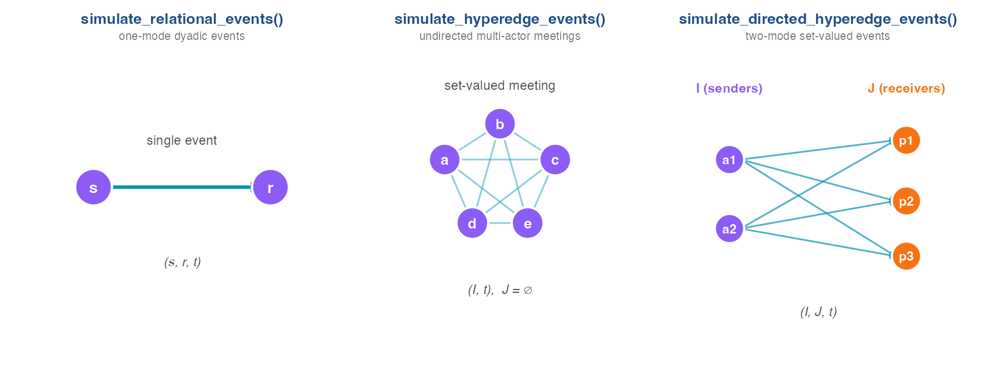
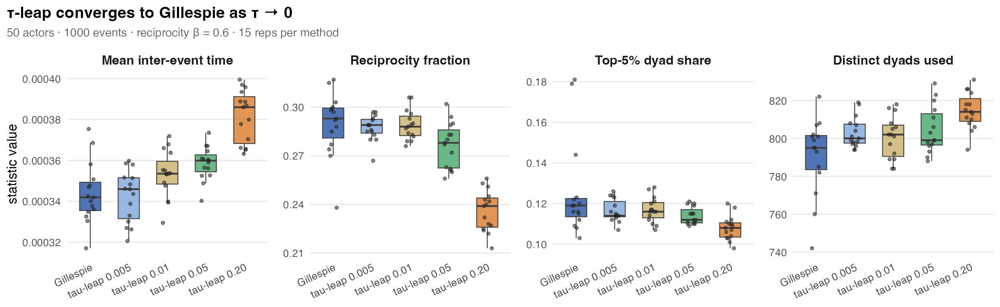
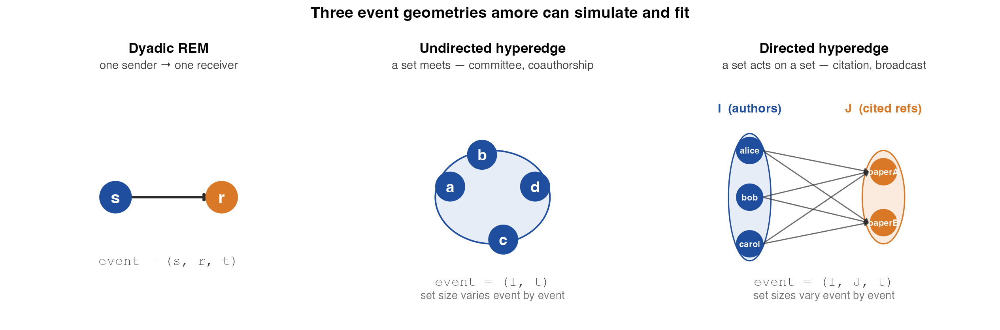
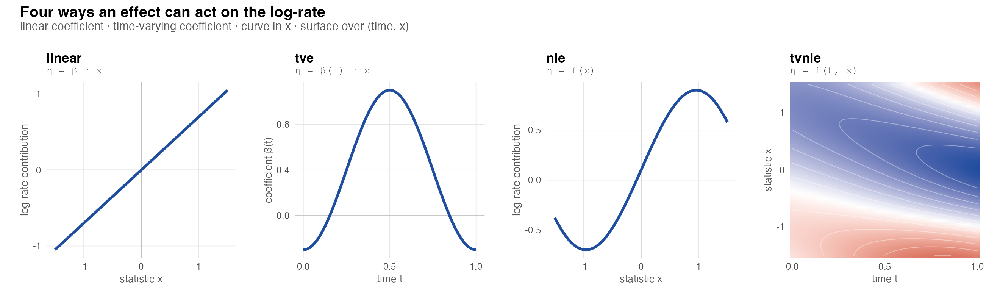

# Part I · Simulation {.section-divider}

## What is a Relational Event Model?

A REM is a statistical model for a **sequence of time-stamped directed interactions** between actors.

The data are a series of events $e_k = (s_k, r_k, t_k)$ — *sender* fires at *receiver* at *time*. Email exchanges, citations, phone calls, animal contacts, patent filings — all REMs.

The model assigns each pair $(s, r)$ a **hazard** at every instant $t$, conditional on the history $\mathcal{H}_t$ up to that point:

$$
\lambda_{sr}(t \mid \mathcal{H}_t) \;=\; \lambda_0(t)\, \exp\!\Big(\,\beta^\top x_{sr}(t)\,\Big)
$$

The covariates $x_{sr}(t)$ can be **exogenous** (actor attributes), **endogenous** (network statistics like reciprocity, transitivity — they depend on $\mathcal{H}_t$), or **global** (time-varying environmental signals). The β's are what we want to learn.

---

## What does it mean to simulate one?

Inference asks: *given the data, which β?* &nbsp;&nbsp; Simulation asks the inverse:

> *Given the β's, draw the data.*

Concretely — given a hazard $\lambda_{sr}(t \mid \mathcal{H}_t)$ defined by your chosen mechanisms, draw a sequence of events that obeys it. This is a **marked point process** simulation:

1. From time $t$, draw the next event time $\Delta t \sim \mathrm{Exp}\Big(\sum_{sr}\lambda_{sr}(t)\Big)$.
2. Draw the firing dyad $(s, r)$ in proportion to $\lambda_{sr}(t)$.
3. Append $(s, r, t + \Delta t)$ to the history. The endogenous statistics update *because the history just changed*.
4. Repeat until you've fired the requested number of events (or run out of time horizon).

This loop is **non-trivial** — endogenous statistics make the hazard a function of its own past output, so naive snapshot methods don't work. That's the engine inside `simulate_relational_events()`.

---

## Why simulate REMs?

Four concrete uses, none of which the real data alone gives you:

- **Validation.** Plug a known β into the simulator → check the fitter recovers it. If it doesn't, the bug is in the *fitter*, not the data.
- **Power.** How many events does a study need to detect a small effect at 80% power? Simulate at the target sample size and see.
- **Counterfactuals.** What does the dynamic look like *without* reciprocity? Re-run with the term zeroed out.
- **Method development.** Every new effect type, every new test, every diagnostic gets stress-tested on synthetic data first.

> "If you can simulate it, you can fit it."

---

## What `amore` ships · three simulators

{.fit-tall}

| | output row | typical domain |
|---|---|---|
| `simulate_relational_events()` | `(sender, receiver, time)` | email, phone calls, animal contacts |
| `simulate_hyperedge_events()` | `(I, time)`, `J = ∅` | group meetings, committee co-attendance |
| `simulate_directed_hyperedge_events()` | `(I, J, time)` | co-authored papers citing reference lists |

All three drive the **same** composable rate model and the same five mechanisms (next slide).

---

## The data model

A relational event log: ordered triples `(sender, receiver, time)`.

```r
data(classroom_events)
head(classroom_events)
#>   time sender receiver  ...
#> 1 0.12     14       12  social
#> 2 0.25     12       14  social
#> 3 0.37     18       12  sanction
```

Hyperedges generalise this to set-valued `(I, J, time)`:

```r
hl <- hyperedge_log(
  I    = list(c("alice","bob"), c("alice","carol")),
  J    = list(c("paperA"),       c("paperA","paperB")),
  time = c(1.0, 2.5))
```

---

## Five composable mechanisms

The per-dyad next-event rate at time $t$ is built up additively on the log scale:

$$
\log \lambda_{sr}(t) = \log \lambda_0 \;+\; \underbrace{c_{sr}}_{\text{static dyad}} \;+\; \underbrace{\alpha_s + \rho_r}_{\text{actor covariates}} \;+\; \underbrace{\sum_k \beta_k \, x_{srk}(t)}_{\text{endogenous}} \;+\; \underbrace{g(t)^\top \gamma}_{\text{global}}
$$

| # | Mechanism | Argument |
|---|---|---|
| 1 | Baseline rate $\lambda_0$ | `baseline_rate` |
| 2 | Static per-dyad logits | `contribution_logits` |
| 3 | Sender / receiver covariates | `sender_*` / `receiver_*` |
| 4 | Endogenous statistics (any of 68) | `endogenous_stats`, `endogenous_effects` |
| 5 | Time-varying globals | `global_covariates`, `global_effects` |

Turn any subset on or off — the simulator composes them.

---

## A minimal call

The simplest possible simulator: 8 actors, a baseline rate, nothing else.

```r
ev <- simulate_relational_events(
  n_events      = 500,
  senders       = paste0("a", 1:8),
  receivers     = paste0("a", 1:8),
  baseline_rate = 1)
```

Add a single endogenous mechanism — reciprocity at β = 0.6:

```r
ev <- simulate_relational_events(
  n_events           = 500,
  senders            = paste0("a", 1:8),
  receivers          = paste0("a", 1:8),
  baseline_rate      = 1,
  endogenous_stats   = "reciprocity_count",
  endogenous_effects = c(reciprocity_count = 0.6))
```

The simulator returns an event log; set `n_controls ≥ 1` to get a **case-control table** directly.

---

## What comes out

{.fit-tall}

Each vertical segment is one event linking its **sender** (violet) to its **receiver** (orange) at the firing time. The dense column on the right is the reciprocity-driven burst — once a few dyads start exchanging, they keep firing at each other.

---

## Two algorithms: Gillespie vs τ-leap

Two ways to draw the next event:

- **Gillespie (exact).** Compute the next event time as $\Delta t \sim \text{Exp}(\sum_{sr} \lambda_{sr}(t))$, draw the firing dyad proportional to its rate. One event at a time, exact.
- **τ-leap (approximate).** Advance the clock by a fixed step `τ`; fire all events that would have happened in that slice as a Poisson batch. Much faster — but events inside the same slice don't see each other.

```r
simulate_relational_events(..., method = "tau_leap", tau = 0.05)
```

Trade-off: τ controls bias (intra-step reactions are lost) vs speed (fewer evaluations).

---

## τ-leap: a knob between fidelity and speed

{.fit-tall}

{.fit-tall}

**Top:** at small τ the four stream-level statistics are indistinguishable from Gillespie; at large τ they drift — intra-step events don't see each other, so reciprocity is under-counted and the dyad mass spreads. **Bottom:** the speedup grows with the actor universe — modest at 25 actors, dramatic at 100. Pick τ where convergence is acceptable *and* the speedup is meaningful for your scenario.

# Part II · Endogenous structure {.section-divider}

## 68 statistics on a single grid

**Six families × seven variant axes**.

::: columns
::: {.column width="50%"}

**Families**

- per-actor
- **reciprocity**
- **transitivity**
- **cyclic**
- sending balance
- receiving balance

:::
::: {.column width="50%"}

**Variant axes**

- `count`
- `binary`
- `exp_decay`
- `time_recent`
- `time_first`
- `ordered`
- **`interrupted`**

:::
:::

The `*_interrupted` family is the methodological core of Juozaitienė & Wit (2024): a closure event **resets** the counter.

---

## Same history · seven variant summaries

{.fit}

{.fit-tall}

Blue (Y→X) ticks count toward reciprocity on the focal X→Y dyad; red (X→Y) ticks **reset** the `*_interrupted` variants. Same history, seven curves — each captures a different closure mechanism. The choice is not cosmetic: it is a hypothesis about *how* the past acts on the present.

# Part III · Hyperedge models {.section-divider}

## From dyads to sets

{.fit}

Most REM data are dyadic — one sender, one receiver. But many real event streams are not: a **committee meeting** has $|I| > 2$ attendees acting together; a **paper citation** has a set of authors $I$ acting on a set of cited references $J$. The classical $(s, r, t)$ schema cannot encode either.

`amore` extends the same rate-and-effect machinery to **set-valued events** — $(I, t)$ for undirected hyperedges, $(I, J, t)$ for directed ones — following Boschi, Lerner & Wit (2025). The simulator, the case-control sampler, and the GAM fitter all work the same way; only the event schema is wider.

---

## Set-valued events

For citation-style data — `I` = co-authors, `J` = cited papers:

```r
hl <- simulate_directed_hyperedge_events(
  n_events  = 150,
  senders   = paste0("a", 1:4),
  receivers = paste0("p", 1:4),
  max_size_I = 3, max_size_J = 2,
  baseline_rate = 0.3,
  endogenous_stats   = c("subrep_1_1", "size_I"),
  endogenous_effects = c(subrep_1_1 = 0.8, size_I = -0.6))
```

`size_I < 0` ⟶ smaller sender sets.  
`subrep_1_1 > 0` ⟶ preferential attachment to subsets that already co-occurred.

---

## How the two effects shape `|I|`

{.fit}

`subrep = 0.8` alone pushes **85%** of events to singletons; combined with a size penalty, **94%**.

---

## Preferential attachment in motion

{.fit}

Once a 2-set has met, `subrep_2 > 0` makes it more likely to meet again. **One pair captures 146 of 150 events.**

# Part IV · Estimation {.section-divider}

## The estimation problem · case-control PL

For each focal event $(s_k, r_k, t_k)$, the full partial likelihood divides by a sum over **every admissible dyad**:

$$
\ell_k(\theta) \;=\; \log \frac{\lambda_{s_k r_k}(t_k \mid \mathcal{H}_{t_k})}{\sum_{(s,r)} \lambda_{sr}(t_k \mid \mathcal{H}_{t_k})}
$$

On a 1000-actor network that is $\sim 10^6$ rate evaluations *per event*. Millions of events make this intractable.

**Nested case-control sampling** (Borgan & Langholz 1995) replaces the denominator with a random sub-sum: at each focal event draw $m$ non-events uniformly from the admissible dyads. The conditional likelihood

$$
\ell_k(\theta) \;=\; \log \frac{e^{\eta_k}}{e^{\eta_k} + \sum_{j \in \mathrm{ctrl}_k} e^{\eta_j}}
$$

is consistent for the same $\beta$ and scales **linearly** in the event count. `amore` builds the case-control table inside `simulate_relational_events(..., n_controls = m)` and every `compare_models*()` entry point consumes it.

---

## What does `amore` actually fit?

`amore` is **data engineering**, not a custom optimizer. Every `compare_models*()` call builds a case-control table and dispatches to a well-tested R backend:

| Spec | Backend | Role |
|---|---|---|
| linear, no RE | `survival::clogit` | conditional logistic regression on the case-control strata |
| linear + sender RE | `survival::clogit` with sender strata | one-axis Gamma frailty |
| linear + sender × receiver RE | `coxme::coxme` | two-axis Gamma frailty |
| smooth (any of `linear` / `tv` / `nl` / `tvnl`) | `mgcv::gam(method = "REML")` | GAM on the case-vs-control matrix design |
| global covariates | `mgcv::gam` on the time-shifted table | identifies $g(t)$ effects |
| **(roadmap) DREAM** | `torch` Neural Additive Model | large-scale, non-linear, multi-covariate |

One conceptual likelihood — the **case-control conditional partial likelihood** — fit by different machinery depending on what shape of effect you need. AICs are comparable across calls *because they share one case-control draw*, so the likelihood support is identical.

---

## `compare_models()` — linear AIC

A **linear model** in the endogenous statistics:

$$
\log \lambda_{sr}(t) \;=\; \beta_0 \;+\; \sum_k \beta_k \, x_{sr,k}(t)
$$

— one coefficient per statistic, no time-dependence in $\beta$, no curvature in $x$. The simplest spec the catalogue can produce, and the baseline before reaching for smooth.

`compare_models()` takes a *named list of specs*, fits each one by `survival::clogit` on the case-control table, and ranks them by AIC. **AIC, not LRT** — the candidate specs are usually **non-nested**: `count` and `time_recent` share no parameters, so the likelihood-ratio test does not apply, but AIC's complexity penalty handles different parameter counts cleanly.

```r
compare_models(
  classroom_events,
  models = list(
    count       = c("reciprocity_count", "transitivity_count"),
    continuous  = c("reciprocity_time_recent", "transitivity_time_recent"),
    interrupted = c("reciprocity_time_recent_interrupted",
                    "transitivity_time_recent_interrupted")),
  n_controls = 3, seed = 11)
```

Returns a tibble — one row per named spec, columns AIC, BIC, $\Delta$AIC and a convergence flag. Optional `random_effects = "sender"` or `c("sender", "receiver")` adds Gamma frailty (one-axis via `survival::clogit` strata, two-axis via `coxme::coxme`).

---

## Four ways an effect can be smooth

{.fit}

Boschi et al. (2025) cast every smooth shape as an `mgcv::gam` term on a case-vs-control matrix design. `linear` is a coefficient; `tv` lets that coefficient drift in time; `nl` lets the effect itself curve in the stat value; `tvnl` does both — a surface over (time, stat).

| Effect | Smooth term in `gam` |
|---|---|
| `linear` | `d_stat = case − control` |
| `tv` | `s(.time, by = d_stat)` |
| `nl` | `s(stat_mat, by = I_mat)` |
| `tvnl` | `te(time_mat, stat_mat, by = I_mat)` |

`compare_models_smooth()` dispatches each spec to the right smooth term. AICs are comparable across specs because **all specs share one case-control draw**.

---

## Manufacturing · smooth effect curves

{.fit-tall}

Top row: **continuous** variants — "boost then decay".  
Bottom row: **interrupted** variants — "dip then partial recovery", the cycle-closure-reset signature.

---

## Why globals cancel · time-shift fix

Temperature, time-of-day, residual baseline hazard $g_0(t)$ — a global covariate $g(t)$ has the **same value for every dyad at the same instant**. Standard NCC PL evaluates the case event and its controls at the same $t_k$, so $g(t_k)$ enters numerator and denominator identically:

$$
\frac{e^{\beta g(t_k) + \eta_k}}{\sum_j e^{\beta g(t_k) + \eta_j}} \;=\; \frac{e^{\eta_k}}{\sum_j e^{\eta_j}}
$$

The global **cancels**; $\beta$ is non-identifiable.

**Lembo et al. (2025) fix:** evaluate each non-event at a random earlier time $t_k - H_{sr}$, with $H_{sr} \sim \mathrm{Exp}(\lambda)$. The case sits at $t_k$, each control sits at a different earlier instant — $g$ no longer cancels and $\beta$ becomes identifiable. Pick $\lambda$ small enough that the shifts reach the time-scale on which $g$ varies; too small and the case-control matching loses local power.

---

## `compare_models_global()` — API

```r
compare_models_global(event_log,
  models = list(with_global =
    c(reciprocity_count = "linear",
      temperature       = "global_smooth")),
  global_covariates = g)
```

Three new effect types layer on top of the four smooth ones:

- `global_smooth` — `s(g)` thin-plate spline in the covariate value
- `global_cyclic` — cyclic spline (time-of-day, day-of-week)
- `global_time` — `s(t)` in calendar time (residual baseline hazard)

The shifted case-control table is built once and re-used across specs, keeping AICs comparable.

# Part V · Goodness-of-fit {.section-divider}

## Point-process foundation

A REM is a multivariate counting process. For each dyad $(s,r)$:

$$
N_{sr}(t) \;=\; \#\{\text{events on } (s,r) \text{ in } [0,t]\}
$$

$$
A_{sr}(t \mid \theta) \;=\; \int_0^{t} \lambda_{sr}(u \mid \mathcal{H}_u;\, \theta)\, du
\qquad \text{(compensator)}
$$

$$
M_{sr}(t \mid \theta) \;=\; N_{sr}(t) \;-\; A_{sr}(t \mid \theta)
\qquad \text{(martingale)}
$$

Under the **true** $\theta$, $M_{sr}$ is a mean-zero square-integrable martingale w.r.t. $\mathcal{H}_t$. The sample path $\hat M_{sr}(t) := M_{sr}(t \mid \hat\theta)$ is the **residual process** — its fluctuations carry every piece of model misspecification we can detect from the data alone.

---

## Cumulative martingale residual process

Aggregate residuals across dyads, weighted by a covariate kernel $h_\gamma$ that selects "where" to look:

$$
G[\gamma, u] \;=\; \sum_{(s,r)} \int_0^{u} h_\gamma(s, r, t)\, dM_{sr}(t \mid \hat\theta)
$$

Standardize by the observed information $\hat J = -\partial^2 \ell / \partial\theta\partial\theta^\top$ at $\hat\theta$:

$$
\hat W[\hat\gamma, u] \;=\; \hat J^{-1/2}\, n^{-1/2}\, G[\hat\gamma, u]
$$

Under correct specification, $\hat W \Rightarrow \mathbf{B}^\circ$ on $[0,1]$, a multivariate standard **Brownian bridge**. Boundary functionals of $\hat W$ give the test battery:

| Function | Statistic | p-value |
|---|---|---|
| `gof_univariate` | $\sup_u \|\hat W[u]\|$ | exact KS series |
| `gof_multivariate` | $\sup_u \|\hat W[u]\|^2$ | simulated BB |
| `gof_global` | Cauchy combination | $\tfrac12 - \arctan(T_o)/\pi$ |
| `gof_auxiliary` | $\sup_u \|G[u]\|/\sqrt n$ | $N_k$ multipliers |

---

## GOF on Classroom · the signal

{.fit}

`reciprocity_count` (blue) stays inside the 95% BB envelope. **`transitivity_count` (orange) punches through at u ≈ 0.3** — the omnibus rejects with $p < 10^{-3}$, and the per-component test **pinpoints which term to fix**.

---

## Pointwise diagnostic

{.fit-tall}

`martingale_residuals()` returns $M_i = y_i - \pi_i$ per observation. Residuals sum to zero within each (case, control) stratum.

# Part VI · Data {.section-divider}

## Five bundled datasets

| Dataset | Events | Actors | Span | Type |
|---|---:|---:|---:|---|
| Classroom | 691 | 20 | 44 d | face-to-face |
| Social Evolution | 439 | 54 | 42 d | phone calls |
| Manufacturing | 82,927 | 167 | 271 d | email |
| **CollegeMsg** | 59,835 | 1,899 | 194 d | instant messages |
| **Email-EU-Core** | 12,216 | 89 | 803 d | email |

---

## Event-rate per dataset

{.fit}

All five datasets are **non-stationary** — term boundaries, weekly cycles, weekend dips, front-loading.

---

## Actor activity is heavy-tailed

{.fit}

Classroom is bell-shaped; Manufacturing and CollegeMsg span three orders of magnitude. **Sender / receiver frailty is not optional** on heavy-tailed data.

# Part VII · Validation {.section-divider}

## Recovery is calibrated

{.fit}

30 reps per β, 800-event runs. **95% Wald coverage on target** across the range.

---

## Smooth effects too

{.fit}

Non-linear $f(x) = \sin(x) - 0.3(x - 3)$ injected via `contribution_logits`, recovered at **corr 0.998, RMSE 0.075** by a p-spline `clogit`.

# Next steps {.section-divider}

## DREAM · Deep Relational Event Additive Model

**Filippi-Mazzola & Wit (2024, *Social Networks* 79, 25-33)** — a fifth foundation paper, sitting next to `compare_models_smooth()` as a scalable backend for non-linear effects.

Each $f_k(x_{srk})$ is fit by an **independent small feed-forward neural network** (Neural Additive Model). ADAM, GCU activation, dropout. Same NCC partial likelihood `amore` already uses. Uncertainty via post-hoc Gaussian Process regression.

| Scale | `mgcv::gam` (NLE) | DREAM |
|---|---|---|
| 100k events × 1k actors, 10 covariates | ~500 s | ~80 s |
| 500k × 5k actors, 4 covariates | ~600 s | ~50 s |
| 500k × 5k actors, ≥ 5 covariates | fails to converge | converges |
| 100 M citations × 8 M actors (US patents) | not feasible | **feasible** |

---

## Planned `amore` integration

```r
compare_models_dream(
  event_log, models,
  hidden     = c(64, 64),     # ANN architecture per covariate
  activation = "gcu",          # Growing Cosine Unit
  dropout    = 0.1,
  epochs     = 200,
  uncertainty = "gpr",         # or "bootstrap"
  device     = c("cpu","mps","cuda"))
```

- Backend: the `torch` R package (mlverse — no Python, Apple Silicon via MPS).
- **Suggests**-only — users without `torch` keep the `mgcv` path intact.
- Output contract matches `compare_models_smooth()`, so the `gof_*` battery plugs in unchanged.

Beyond DREAM, the same NN backend opens the door to **pairwise interaction effects** $f(x_{srk}, x_{srk'})$ — currently out of reach for the spline basis.

---

## Code & references

::: columns
::: {.column width="60%"}

**Repository**  
<https://github.com/franciscorichter/amore>

**Wiki**  
<https://github.com/franciscorichter/amore/wiki>

**References**

- Juozaitienė & Wit *(2024, JRSS-A)*
- Boschi, Lerner & Wit *(2025)*
- Lembo, Juozaitienė, Vinciotti & Wit *(2025, JRSS-C)*
- Boschi & Wit *(2025, Stat & Comp 36:4)*

:::
::: {.column width="40%"}
{.thanks-logo}
:::
:::
