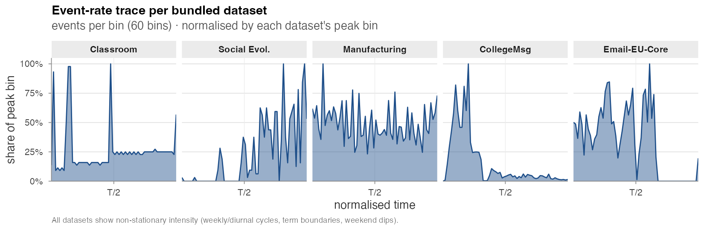
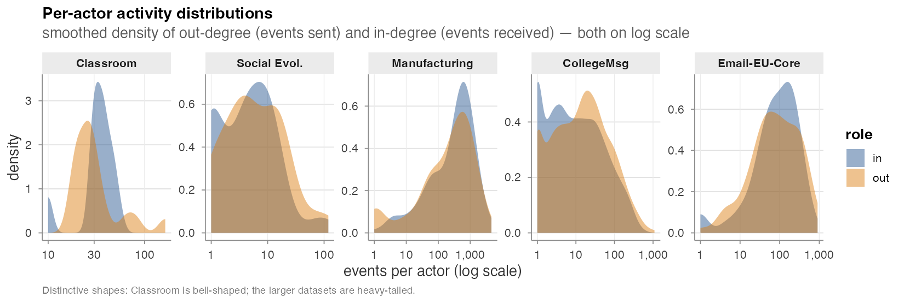

# Bundled datasets

`amorem` ships five real-world relational-event datasets directly,
each as a tidy `(time, sender, receiver, ...)` event table loadable
via `data(...)`. They span three orders of magnitude in size and
cover three interaction types — face-to-face contact, phone calls,
and email / instant messaging.

| Dataset | `data(...)` | Events | Actors | Span | Rate (/day) | Interaction |
|---|---|---:|---:|---:|---:|---|
| Classroom | `classroom_events` | 691 | 20 | 44 d | 15.8 | face-to-face |
| Social Evolution | `social_evolution_calls` | 439 | 54 | 42 d | 10.4 | phone calls |
| Manufacturing | `radoslaw_email` | 82,927 | 167 | 271 d | 305.8 | email |
| CollegeMsg | `college_msg` | 59,835 | 1,899 | 194 d | 308.9 | instant messages |
| Email-EU-Core | `email_eu_core` | 12,216 | 89 | 803 d | 15.2 | email |

## Event-rate trace

The bundled datasets are emphatically *non-stationary*: term
boundaries, weekly cycles, weekends, and bursty episodes all show
up in the per-bin rate. This is exactly the regime the
time-varying / global-covariate machinery in
[Estimation](estimation.html) is built for.



- **Classroom**: two spikes corresponding to the two recorded
  sessions; otherwise quiet.
- **Social Evolution**: linear ramp-up — calls accumulate as the
  recording instrumentation rolls out.
- **Manufacturing** & **Email-EU-Core**: visible weekly modulation
  superimposed on a roughly stationary base rate.
- **CollegeMsg**: front-loaded — student onboarding traffic in the
  first quarter dominates the entire stream.

## Per-actor activity distributions

Out-degree (events sent) and in-degree (events received), per
actor, smoothed on a log scale:



- **Classroom** is bell-shaped on a tight log axis — small
  homogeneous group.
- **Social Evolution** and **Email-EU-Core** show moderately
  heavy tails.
- **Manufacturing** and **CollegeMsg** are unambiguously
  heavy-tailed across three orders of magnitude — a small core
  drives most of the traffic.

These differences matter for inference: the `*_count` family in
the [Endogenous catalogue](endogenous-catalogue.html) absorbs activity
heterogeneity directly, so heavy-tailed datasets like
Manufacturing and CollegeMsg make sender / receiver random
effects (or `compare_models_smooth()` non-linear specs) a near-
requirement for honest interpretation. See
[Real-data analysis](real-data-analysis.html) for the worked example
on Classroom (where the AIC ranking flips once sender frailty is
added).

## Provenance

- **Classroom** — `networkDynamic` CRAN package. McFarland (2001).
- **Social Evolution** — `goldfish` GitHub package. Madan et al.
  (2011).
- **Manufacturing** — Network Repository, `ia-radoslaw-email`.
  Michalski et al. (2014).
- **CollegeMsg** — SNAP, `CollegeMsg.txt.gz`. Panzarasa, Opsahl &
  Carley (2009).
- **Email-EU-Core** — SNAP, `email-Eu-core-temporal-Dept3`.
  Paranjape, Benson & Leskovec (2017). Self-loops removed.

The fourth dataset analysed by Juozaitienė & Wit (2024) — Enron —
is intentionally not bundled because the only publicly archived
version is an aggregated daily edge-weight table rather than the
event-level slice the paper analyses.

## Time conventions

Times are normalised to **days since the first event** for every
dataset except Classroom, which uses **minutes** (its original
time unit). The original Unix-epoch timestamps are preserved as a
`unix_origin` attribute on each event frame where the source
provided them:

```r
data(radoslaw_email)
attr(radoslaw_email, "unix_origin")
#> [1] "2010-01-02 14:45:35 UTC"

data(college_msg)
attr(college_msg, "unix_origin")
#> [1] "2004-04-15 03:02:41 UTC"
```

## Auxiliary objects

- `classroom_actors`, `social_evolution_actors`,
  `social_evolution_friendship` — per-actor covariates and the
  friendship-survey event log accompanying their main event
  tables.
- `dist_matrix` — a 56 × 56 matrix of inter-state geographic
  distances; used by Experiment 2 in
  [Validation experiments](validation-experiments.html).

## Citing the datasets

If you publish results from any bundled dataset, please cite the
original source in addition to citing `amorem`:

- McFarland, D.A. (2001). *Student resistance: How the formal and
  informal organization of classrooms facilitate everyday forms
  of student defiance.* American Journal of Sociology.
- Madan, A. et al. (2011). *Sensing the "health state" of a
  community.* IEEE Pervasive Computing.
- Michalski, R. et al. (2014). *Matching organizational structure
  and social network extracted from email communication.* New
  Generation Computing 32(3–4), 213–235.
- Panzarasa, P., Opsahl, T., Carley, K. (2009). *Patterns and
  dynamics of users' behavior and interaction: Network analysis
  of an online community.* Journal of the American Society for
  Information Science and Technology 60(5), 911–932.
- Paranjape, A., Benson, A.R., Leskovec, J. (2017). *Motifs in
  temporal networks.* WSDM '17, 601–610.
- Juozaitienė R., Wit E.C. (2024). *It's about time: revisiting
  reciprocity and triadicity in relational event analysis.*
  JRSS-A 188(4), 1246–1262.
