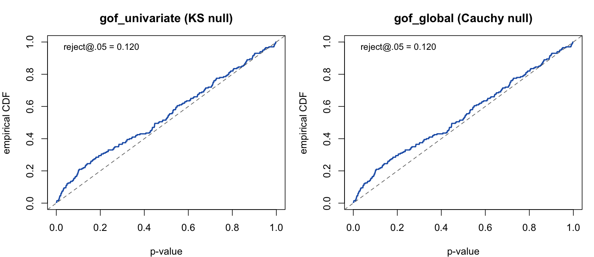

# Goodness-of-fit calibration

The martingale-residual goodness-of-fit family (`gof_univariate()`,
`gof_global()`, `gof_auxiliary()`, `martingale_residuals()`) reports p-values
against an analytic null. This article documents an empirical study of **when
those p-values are exact and when they should be read as diagnostic**. In short:
the tests are well calibrated under the null and for *bounded* statistics, and
become anti-conservative for *unbounded count* statistics in the presence of a
real effect. This is a finite-sample property of the test, not a coding error —
but it changes how the tests should be used.

**Method.** A type-I error-rate study under *correct specification*: simulate
from a model, fit the **same** model, and collect GoF p-values. Under a
calibrated test these are Uniform(0, 1), so the empirical rejection rate at level
α should equal α. Settings below use a 20-actor one-mode network, the Gillespie
simulator, 1{,}500 events and 150 replicates per cell unless stated, and a single
control per case (the `m = 2` design the GoF uses).

```r
library(amorem)
actors <- paste0("a", 1:20)

# one replicate under correct specification: simulate with a known effect,
# fit the same linear model, return the gof_univariate p-value
gof_rep <- function(i, beta, stat = "reciprocity_count", half_life = NULL) {
  set.seed(70000L + i)
  ev <- simulate_relational_events(
    n_events = 1500, senders = actors, receivers = actors,
    endogenous_stats = stat, endogenous_effects = setNames(beta, stat),
    half_life = half_life, method = "gillespie")
  gof_univariate(ev, model = setNames("linear", stat), covariate = stat,
                 half_life = half_life, seed = 90000L + i)$p_value
}

type_I <- function(beta, ...) {
  p <- vapply(1:150, gof_rep, numeric(1), beta = beta, ...)
  c(rejection_05 = mean(p < 0.05), ks_uniformity = ks.test(p, "punif")$p.value)
}
```

---

## Calibrated under the null

With no true effect the test is calibrated (indeed mildly conservative), and the
p-values pass a uniformity check:

| true β | type-I @ .05 | p-value uniformity (KS) |
|---:|---:|---:|
| 0.0 | 0.013 | 0.61 |
| 0.1 | 0.027 | — |

---

## Anti-conservative for counts with a real effect

Once a real moderate effect is present, the rejection rate climbs above
nominal — and it is **not** driven by numerical separation in the fit
(at β = 0.2 essentially no strata are separated):

| true β (`reciprocity_count`) | type-I @ .05 | mean separation |
|---:|---:|---:|
| 0.0 | 0.013 | 0.00 |
| 0.2 | 0.147 | 0.01 |
| 0.3 | 0.213 | 0.33 |
| 0.5 | 0.107 | 0.68 |

The empirical CDF of the p-values bows above the diagonal at small p — the
signature of over-rejection:



The driver is the **nature of the covariate**, not its scale. At a matched
moderate effect (β = 0.2, negligible separation):

| covariate | nature | type-I @ .05 |
|---|---|---:|
| `recency` | bounded, resets | **0.053** |
| `reciprocity_exp_decay` | bounded by decay | 0.093 |
| `reciprocity_count` | unbounded accumulating count | 0.147 |

```r
type_I(0.2, stat = "recency")
type_I(0.2, stat = "reciprocity_exp_decay", half_life = 5)
type_I(0.2, stat = "reciprocity_count")
```

A bounded statistic calibrates; an unbounded count does not. The
cumulative-residual-process asymptotics require each event's increment to be
negligible relative to the whole, and an accumulating count becomes heavy-tailed
late in the stream (a few late, high-count events dominate the process), which
violates that condition.

---

## What does *not* fix it

| attempted remedy | type-I @ β = 0.2 | outcome |
|---|---:|---|
| `scale()` the covariate | 0.147 | no change — the test normalises by the residual variance, so any *linear* rescaling cancels exactly |
| `log1p()` / `sqrt()` the covariate | 0.88 / 0.88 | *worse* — transforming the term misspecifies a linear-in-count truth, and the test correctly rejects |
| multiplier-bootstrap null | 0.113 | partial only |
| parametric bootstrap (re-simulate under β̂, refit) | 0.158 | **no improvement** (≈ analytic 0.158) |

The parametric bootstrap is the decisive test: it is the most principled
reference distribution available — it re-simulates under the fitted null and
re-fits, fully accounting for the estimation effect. Because it over-rejects
*identically* to the analytic null (R = 120: both 0.158, 95% CI 0.098–0.236;
p-values fail uniformity, KS p = 0.008), the problem is **not** the
null-distribution approximation. The observed statistic is genuinely larger than
the fitted model predicts — a real finite-sample lack-of-fit of the
case-1-control (`m = 2`) construction for count covariates with a true effect.

---

## Guidance and outlook

- **Use under the null and for bounded statistics** (`recency`, the decayed
  variants): the p-values are trustworthy.
- **For raw, unbounded count statistics with a real effect**, read the GoF as a
  **diagnostic** — inspect the cumulative residual process and
  `martingale_residuals()` — rather than relying on the exact p-value, which is
  anti-conservative (type-I ≈ 0.15 at the settings above).
- **Open direction.** A proper fix is a methods question rather than a one-line
  patch. The most promising candidate is a **multi-control (risk-set / softmax)
  GoF** in place of the single-control `m = 2` degenerate binomial (the GoF
  currently fixes `n_controls = 1`), or a Khmaladze martingale transform that
  removes the estimation effect from the residual process. Quantifying the
  rejection rate as the number of controls grows is the natural next experiment.

See the [Estimation](estimation.html) guide for the GoF API and
[Validation experiments](validation-experiments.html) for the recovery and
parity studies (E1–E7).
