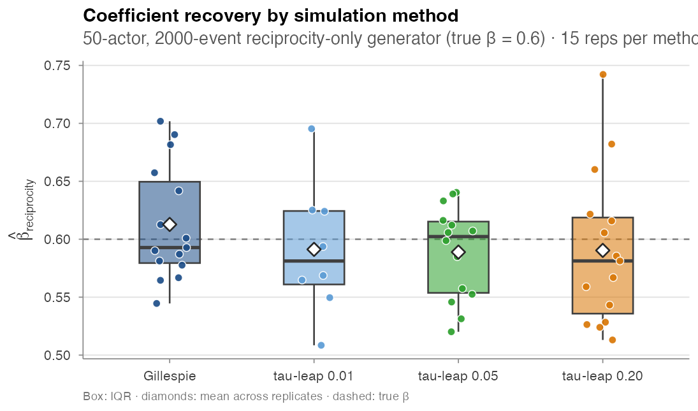
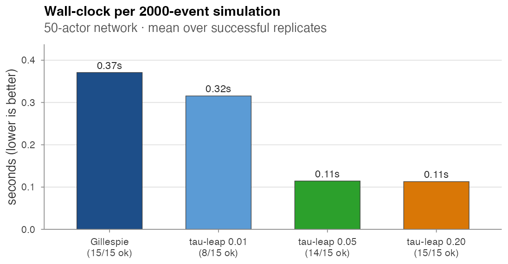

# Simulation

`amore` exposes a single front-door simulator,
`simulate_relational_events()`, that composes five mechanisms on
top of an event-by-event inner loop. Two algorithms drive the loop:
**Gillespie** (exact, per-event) and **τ-leap** (approximate,
fixed time slices). The two are compared at the bottom of this
page.

## The five mechanisms

1. **Minimal Gillespie** — homogeneous baseline rate over all
   admissible dyads.
2. **Per-dyad contribution logits** — a static *S × R* matrix of
   log-rate adjustments (e.g. inter-state distances, role
   similarities).
3. **Exogenous sender / receiver covariates** — per-actor numeric
   tables with their effect vectors.
4. **Endogenous statistics** — any subset of the catalogue listed
   in [Endogenous catalogue](endogenous-catalogue.html), updated after
   each fired event.
5. **Time-varying global covariates** — piecewise-constant
   modifiers tied to an interval grid, advanced with a
   boundary-aware Gillespie scheme.

### Per-feature argument map

| Feature | Arguments | Notes |
|---|---|---|
| Dyad-level contribution | `contribution_logits` | *S × R* matrix of log-rate contributions |
| Static sender / receiver | `sender_covariates`, `sender_effects`, `receiver_covariates`, `receiver_effects` | per-actor tables; effects required |
| Endogenous | `endogenous_stats`, `endogenous_effects` | any stat from the catalogue |
| Exp-decay half-life | `half_life` | required when any `*_exp_decay` stat is active |
| Time-varying global | `global_covariates`, `global_effects` | piecewise constant on `time_start` intervals |
| Case–control output | `n_controls` | ≥ 1 activates stratified output |
| Algorithm | `method`, `tau` | `"gillespie"` (exact) or `"tau_leap"` |
| Risk-set rule | `risk` | `"standard"` or `"remove"` |

## Idiomatic calls

### Minimal Gillespie

```r
ev <- simulate_relational_events(
  n_events      = 500,
  senders       = LETTERS[1:6],
  receivers     = LETTERS[1:6],
  baseline_rate = 1)
```

### Endogenous structure

```r
ev <- simulate_relational_events(
  n_events           = 1000,
  senders            = letters[1:10],
  receivers          = letters[1:10],
  endogenous_stats   = c("reciprocity_count", "transitivity_count"),
  endogenous_effects = c(reciprocity_count = 0.4,
                          transitivity_count = 0.3))
```

### Case–control output

Set `n_controls = k` to emit a stratified case–control table
directly: each fired event becomes one *case* row paired with `k`
*control* rows drawn from the non-event risk set at that moment,
sharing a `stratum` id.

```r
cc <- simulate_relational_events(
  n_events           = 1200,
  senders            = paste0("a", 1:20),
  receivers          = paste0("a", 1:20),
  endogenous_stats   = "reciprocity_count",
  endogenous_effects = c(reciprocity_count = 0.6),
  n_controls         = 1)
```

### Time-varying global covariates

```r
g <- data.frame(time_start = c(0, 2, 5),
                weekend    = c(0, 1, 0))
ev <- simulate_relational_events(
  n_events          = 800,
  senders           = LETTERS[1:8],
  receivers         = LETTERS[1:8],
  baseline_rate     = 1,
  global_covariates = g,
  global_effects    = c(weekend = -1.5))
```

A boundary-aware Gillespie scheme advances the clock across each
`time_start` boundary without artificially recording or losing
events.

---

## Gillespie vs τ-leap

Same scenario in both algorithms: 50-actor network, 2,000 events,
reciprocity at β = 0.6, one control per case, 15 replicates per
method. For each replicate we record the wall-clock of the
simulator call and the recovered β̂ from
`clogit(event ~ reciprocity_count + strata(stratum))`.

### Statistical equivalence

| Method | β̂ mean | β̂ SD | wall-clock (s) | successes / 15 |
|---|---:|---:|---:|---:|
| Gillespie | 0.613 | 0.050 | 0.37 | 15 |
| τ-leap @ τ = 0.01 | 0.591 | 0.057 | 0.32 | **8** |
| τ-leap @ τ = 0.05 | 0.589 | 0.041 | 0.11 | 14 |
| τ-leap @ τ = 0.20 | 0.590 | 0.066 | 0.11 | 15 |

On the successful replicates, all four methods recover β within
~0.02 of the truth (Gillespie's mean of 0.613 sits slightly above,
the τ-leap means slightly below). At this scale the differences
are within Monte Carlo noise. **τ-leap with τ ≥ 0.05 is
statistically equivalent to Gillespie** on the reciprocity-only
generator while running ≈ 3× faster. τ = 0.01 is too small for
this regime — only 8 of 15 runs completed within a 30 s timeout
budget.



### Wall-clock cost

τ-leap at τ ≥ 0.05 runs **about 3× faster** than Gillespie at 50
actors. The crossover grows with the actor universe: in the full
scaling sweep ([Validation experiments / E3](validation-experiments.html)),
τ-leap is 20×–70× faster than Gillespie at 100 actors.



Driver: `paper/wiki/experiments/sim_methods.R`.

### When to pick which

| Use Gillespie when | Use τ-leap when |
|---|---|
| ≤ ~30 actors | ≥ ~50 actors |
| You need every event to react to every prior event | Bias from intra-step reactions is acceptable |
| τ-leap returns "no risk dyads" failures (small / dense regimes) | Wall-clock matters and you can verify τ via a small Gillespie run |

A 15-actor sweep on this same scenario was noticeably unstable
under τ-leap (timeouts and silent failures); the comparison
above uses 50 actors, where τ-leap is well-behaved. Treat τ as
a tunable bias / cost knob and validate it once at the start of
each project.

---

## Related pages

- [Validation experiments](validation-experiments.html) — the full
  wall-clock scaling grid (4 × 5 × 2) and parity tests.
- [Estimation](estimation.html) — how to use the case-control output
  produced by `n_controls ≥ 1`.
